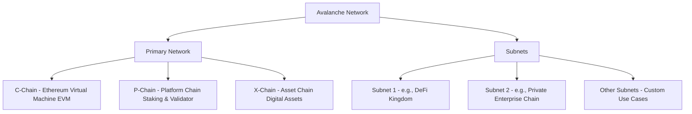

# Lesson 1: Introduction to Avalanche

**Goal:** To provide a high-level overview of the Avalanche network, its key features, and its core innovations, with a focus on how it differs from other blockchain platforms.

**Prerequisites:** A strong understanding of blockchain concepts, including distributed ledgers, smart contracts, and consensus mechanisms. Familiarity with Ethereum is highly recommended.

**Estimated time:** 30 minutes

---

## Conceptual Explanation

Avalanche is a high-performance, scalable, and customizable blockchain platform that is designed to address the "trilemma" of decentralization, security, and scalability. It is not a single blockchain, but rather a platform for launching interoperable blockchains, known as "subnets."

### Key Features and Innovations

*   **Novel Consensus Protocol:** Avalanche uses a unique, probabilistic consensus protocol called "Avalanche consensus" (and its variants, "Snowman" and "Snowball"). Unlike traditional consensus mechanisms that require all nodes to communicate with each other, Avalanche nodes achieve consensus by gossiping with a small, random subset of other nodes. This allows for a high degree of parallelization and results in a network that can process thousands of transactions per second with near-instant finality.
*   **Subnets:** The core innovation of Avalanche is the concept of "subnets." A subnet is a sovereign blockchain network that is validated by a dynamic set of validators. Subnets can have their own custom virtual machines (VMs), consensus mechanisms, and token models. This allows developers to create application-specific blockchains that are tailored to their needs. For example, a subnet could be created for a high-performance decentralized exchange, a private enterprise blockchain, or a blockchain-based game.
*   **Heterogeneous Interoperability:** The Avalanche network is a heterogeneous network of blockchains that is composed of a primary network and a number of subnets. The primary network is a special subnet that is responsible for validating the entire Avalanche network and is composed of three chains: the C-Chain, the P-Chain, and the X-Chain. Subnets can communicate with each other and with the primary network, allowing for a high degree of interoperability.

### The Avalanche Network and Subnets

The Avalanche network is a "platform of platforms," and it's helpful to think of it in layers. At the base is the Primary Network, which is secured by all Avalanche validators. The Primary Network consists of three chains:

*   **The C-Chain (Contract Chain):** This is the chain that will be most familiar to Ethereum developers. It's an instance of the Ethereum Virtual Machine (EVM), and it's where most of the DeFi and NFT activity on Avalanche takes place.
*   **The P-Chain (Platform Chain):** This chain is responsible for coordinating validators and managing subnets. It's where you stake AVAX to become a validator, and it's where you create new subnets.
*   **The X-Chain (Exchange Chain):** This chain is optimized for creating and trading digital assets. It's a directed acyclic graph (DAG), which allows for a high degree of parallelization and results in very fast transaction times.

Above the Primary Network are the subnets. Each subnet is a separate blockchain with its own set of validators. This means that subnets are not dependent on the Primary Network for security, and they can have their own rules and their own gas token.

## Annotated Diagrams (Mermaid)

## Hands-on Lab

There is no hands-on lab for this lesson.

## Exercises

1.  What is the "blockchain trilemma," and how does Avalanche address it?
2.  What is a subnet, and why is it a powerful feature?
3.  What are the roles of the C-Chain, P-Chain, and X-Chain?
4.  How does Avalanche's consensus mechanism differ from traditional consensus mechanisms like PoW and PoS?

## Solutions

1.  The "blockchain trilemma" is the idea that it is difficult for a blockchain to be decentralized, secure, and scalable all at the same time. Avalanche addresses this by using a novel consensus mechanism and by allowing for the creation of subnets, which can be optimized for specific use cases.
2.  A subnet is a sovereign blockchain network that is validated by a dynamic set of validators. It is a powerful feature because it allows developers to create application-specific blockchains that are tailored to their needs.
3.  The C-Chain is used for creating and executing smart contracts. The P-Chain is responsible for coordinating validators and managing subnets. The X-Chain is optimized for creating and trading digital assets.
4.  Avalanche's consensus mechanism is a probabilistic consensus protocol that is based on gossip. Unlike traditional consensus mechanisms that require all nodes to communicate with each other, Avalanche nodes achieve consensus by gossiping with a small, random subset of other nodes. This allows for a high degree of parallelization and results in a network that can process thousands of transactions per second with near-instant finality.

## References

*   [Avalanche Documentation](https://docs.avax.network/)
*   [Avalanche Whitepapers](https://www.avalabs.org/whitepapers)
