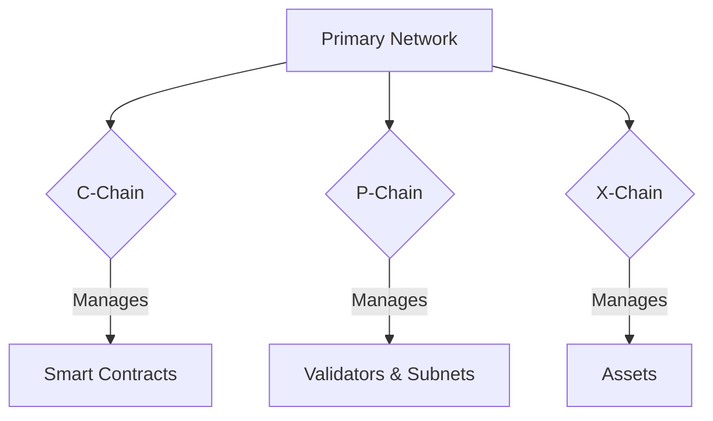

# Lesson 2: The Primary Network: C-Chain, P-Chain, and X-Chain

**Goal:** To understand the roles of the three chains that make up the Avalanche Primary Network, and how they work together.

**Prerequisites:** A basic understanding of the Avalanche network architecture.

**Estimated time:** 35 minutes

---

## Conceptual Explanation

The Avalanche Primary Network is the heart of the Avalanche ecosystem. It's a special Subnet that is validated by all Avalanche validators, and it's composed of three chains, each with a specific purpose: the C-Chain, the P-Chain, and the X-Chain.

### The C-Chain (Contract Chain)

The C-Chain is where you'll spend most of your time as a dApp developer. It's a fully-featured, EVM-compatible smart contract chain, which means you can use the same tools and workflows that you're used to from Ethereum, including:

*   **Solidity:** The most popular smart contract programming language.
*   **Hardhat and Truffle:** The most popular smart contract development environments.
*   **Metamask:** The most popular browser extension for interacting with dApps.
*   **Remix:** The most popular in-browser IDE for Solidity.

The C-Chain is where you'll deploy your smart contracts, mint your NFTs, and build your DeFi protocols. It's also where you'll pay for gas, but unlike Ethereum, the C-Chain uses the AVAX token for gas, and it's much cheaper and faster.

### The P-Chain (Platform Chain)

The P-Chain is the "meta-blockchain" of the Avalanche network. It's responsible for coordinating validators and managing Subnets. You'll interact with the P-Chain when you want to:

*   **Stake AVAX:** To become a validator, you need to stake at least 2,000 AVAX on the P-Chain.
*   **Create a Subnet:** To create a new Subnet, you need to submit a special transaction to the P-Chain.
*   **Add a validator to a Subnet:** To add a validator to a Subnet, you need to submit a special transaction to the P-Chain.

The P-Chain is a critical piece of the Avalanche infrastructure, and it's what makes the network so flexible and customizable.

### The X-Chain (Exchange Chain)

The X-Chain is a high-throughput, low-latency chain that is optimized for creating and exchanging assets. It's a directed acyclic graph (DAG), which allows for a high degree of parallelization and results in very fast transaction times. You'll interact with the X-Chain when you want to:

*   **Create a new asset:** The X-Chain makes it easy to create new fungible and non-fungible tokens.
*   **Send and receive assets:** The X-Chain is the fastest way to send and receive assets on the Avalanche network.

The X-Chain is a powerful tool for building financial applications, and it's a key part of the Avalanche ecosystem.

## Annotated Diagrams (Mermaid)



## Hands-on Lab

In this lab, we will use the Avalanche-CLI to interact with the C-Chain, P-Chain, and X-Chain on a local testnet.

1.  **Start a local testnet:**
    ```bash
    avalanche network start
    ```
2.  **Check the balance on the C-Chain:**
    ```bash
    avalanche wallet balance --chain C
    ```
3.  **Check the balance on the P-Chain:**
    ```bash
    avalanche wallet balance --chain P
    ```
4.  **Check the balance on the X-Chain:**
    ```bash
    avalanche wallet balance --chain X
    ```
5.  **Transfer assets from the X-Chain to the C-Chain:**
    ```bash
    avalanche transaction transfer --from X --to C --amount 1 --asset AVAX
    ```

## Exercises

1.  What is the role of the C-Chain, and why is it so familiar to Ethereum developers?
2.  What is the role of the P-Chain, and why is it so important for the Avalanche ecosystem?
3.  What is the role of the X-Chain, and what makes it so fast?
4.  How do the C-Chain, P-Chain, and X-Chain work together?

## Solutions

1.  The C-Chain is the contract chain, and it's where you'll spend most of your time as a dApp developer. It's so familiar to Ethereum developers because it's a fully-featured, EVM-compatible smart contract chain.
2.  The P-Chain is the platform chain, and it's responsible for coordinating validators and managing Subnets. It's so important for the Avalanche ecosystem because it's what makes the network so flexible and customizable.
3.  The X-Chain is the exchange chain, and it's a high-throughput, low-latency chain that is optimized for creating and exchanging assets. It's so fast because it's a directed acyclic graph (DAG), which allows for a high degree of parallelization.
4.  The C-Chain, P-Chain, and X-Chain work together to form the Primary Network, which is the heart of the Avalanche ecosystem. The C-Chain is where you'll deploy your smart contracts, the P-Chain is where you'll manage your Subnets, and the X-Chain is where you'll create and exchange your assets.

## References

*   [Primary Network and Subnets](https://docs.avax.network/learn/platform-overview#primary-network-and-subnets)
