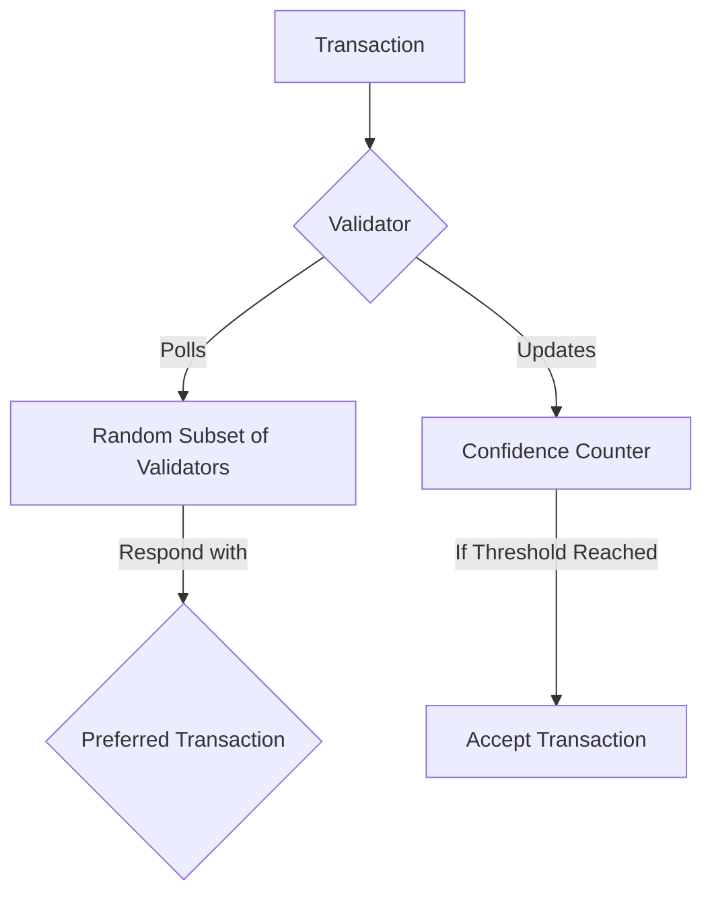

# Lesson 3: Avalanche Consensus

**Goal:** To understand the Avalanche consensus mechanism and how it achieves high throughput, low latency, and scalability.

**Prerequisites:** A basic understanding of consensus mechanisms, such as Proof of Work (PoW) and Proof of Stake (PoS).

**Estimated time:** 40 minutes

---

## Conceptual Explanation

The Avalanche consensus mechanism is a family of protocols that are designed to be highly scalable, efficient, and robust. It is a significant departure from the classical consensus protocols used by other blockchain networks, and it is the key to Avalanche's high performance.

### The Snow Family of Protocols

The Avalanche consensus mechanism is composed of a family of protocols that are known as the "Snow" family. These protocols are:

*   **Slush:** A simple, non-BFT consensus protocol that is used for bootstrapping the network.
*   **Snowflake:** A BFT consensus protocol that is used for leaderless, asynchronous consensus.
*   **Snowball:** A BFT consensus protocol that is used for leader-based, synchronous consensus.
*   **Avalanche:** A BFT consensus protocol that is used for leaderless, asynchronous consensus with high throughput and low latency.

The X-Chain uses the Avalanche consensus protocol, while the C-Chain and P-Chain use the Snowman consensus protocol, which is a linearized version of the Avalanche consensus protocol that is optimized for smart contracts.

### How Avalanche Achieves High Throughput and Low Latency

The Avalanche consensus mechanism is able to achieve high throughput and low latency by using a technique called "sub-sampling." With sub-sampling, each validator only polls a small, random subset of the other validators to determine the state of the network. This allows for a high degree of parallelization, which means that the network can process a large number of transactions in parallel.

Here's a simplified example of how it works:

1.  A user submits a transaction to a validator.
2.  The validator polls a small, random subset of other validators and asks them if they have a preferred transaction.
3.  The other validators respond with their preferred transaction.
4.  The validator updates its own preferred transaction based on the responses it receives.
5.  If the validator sees that a supermajority of the validators it has polled have the same preferred transaction, it will accept that transaction.

This process is repeated over and over again, and it allows the network to come to a consensus on the state of the network very quickly.

### Comparison to Other Consensus Mechanisms

The Avalanche consensus mechanism is a significant improvement over traditional consensus mechanisms, such as PoW and PoS. It is able to achieve higher throughput and lower latency than these mechanisms, while also being more energy-efficient and decentralized.

| Consensus Mechanism | Throughput | Latency | Energy Efficiency | Decentralization |
| --- | --- | --- | --- | --- |
| Proof of Work (PoW) | Low | High | Low | High |
| Proof of Stake (PoS) | Medium | Medium | High | Medium |
| Avalanche | High | Low | High | High |

## Annotated Diagrams (Mermaid)

## Hands-on Lab

There is no hands-on lab for this lesson.

## Exercises

1.  What is the Snow family of protocols, and which chains use which protocols?
2.  What is sub-sampling, and how does it allow Avalanche to achieve high throughput and low latency?
3.  How does the Avalanche consensus mechanism compare to PoW and PoS?
4.  What are the benefits of using a leaderless, asynchronous consensus protocol like Avalanche?

## Solutions

1.  The Snow family of protocols is a family of consensus protocols that are used in the Avalanche network. They are Slush, Snowflake, Snowball, and Avalanche. The X-Chain uses the Avalanche consensus protocol, while the C-Chain and P-Chain use the Snowman consensus protocol.
2.  Sub-sampling is a technique where each validator only polls a small, random subset of the other validators to determine the state of the network. This allows for a high degree of parallelization, which means that the network can process a large number of transactions in parallel.
3.  The Avalanche consensus mechanism is a significant improvement over traditional consensus mechanisms, such as PoW and PoS. It is able to achieve higher throughput and lower latency than these mechanisms, while also being more energy-efficient and decentralized.
4.  The benefits of using a leaderless, asynchronous consensus protocol like Avalanche are that it is more decentralized, more scalable, and more robust than leader-based, synchronous consensus protocols.

## References

*   [Avalanche Consensus](https://docs.avax.network/learn/platform-overview#consensus)
*   [Avalanche Consensus Whitepaper](https://www.avalabs.org/whitepapers)
