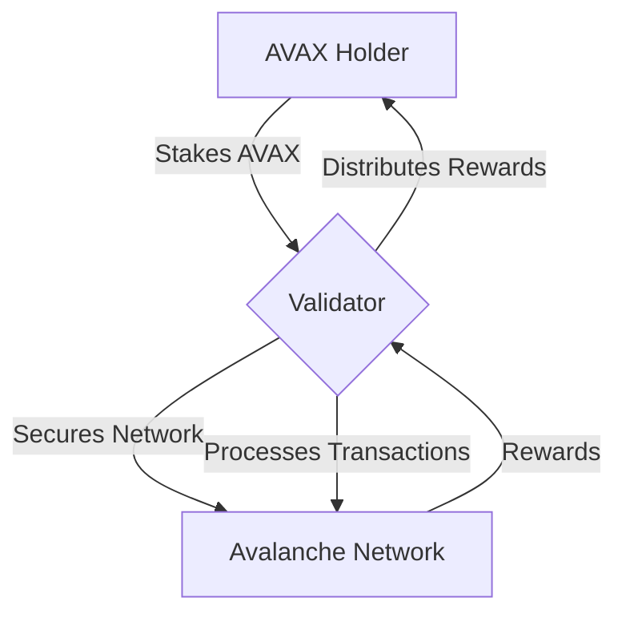

# Lesson 4: Validators and Staking

**Goal:** To understand the role of validators in the Avalanche network, how to become a validator by staking AVAX, and the economics of staking.

**Prerequisites:** A basic understanding of the Avalanche consensus mechanism.

**Estimated time:** 45 minutes

---

## Conceptual Explanation

Validators are the backbone of the Avalanche network. They are responsible for securing the network, processing transactions, and adding new blocks to the blockchain. In return for their service, validators are rewarded with AVAX, the native token of the Avalanche network.

### The Role of Validators

Validators are responsible for:

*   **Securing the network:** Validators secure the network by staking AVAX, which is a process of locking up a certain amount of AVAX in order to participate in the consensus process. The more AVAX that is staked, the more secure the network is.
*   **Processing transactions:** Validators process transactions by verifying that they are valid and by adding them to the blockchain.
*   **Adding new blocks:** Validators add new blocks to the blockchain by participating in the consensus process.

### How to Become a Validator

To become a validator, you must:

1.  **Run a node:** You must run a node that is connected to the Avalanche network. You can run a node on your own hardware or on a cloud provider like AWS or Google Cloud.
2.  **Stake AVAX:** You must stake a certain amount of AVAX, which is currently 2,000 AVAX. You can stake your own AVAX or you can delegate your AVAX to another validator.
3.  **Maintain a high uptime:** You must maintain a high uptime in order to be a reliable validator. If your node goes offline, you will not be able to participate in the consensus process and you will not earn rewards.

### Staking AVAX and Earning Rewards

When you stake AVAX, you are locking up your tokens for a certain period of time. In return for staking your AVAX, you will earn rewards, which are paid out in AVAX. The amount of rewards that you earn will depend on the amount of AVAX that you have staked, the length of time that you have staked it for, and the overall staking rate of the network.

The current staking reward is around 9% per year. You can use the [Avalanche Staking Calculator](https://v2.avax.network/staking) to estimate your potential rewards.

## Annotated Diagrams (Mermaid)



## Hands-on Lab

In this lab, we will use the Avalanche-CLI to stake AVAX on a local testnet.

1.  **Start a local testnet:**
    ```bash
    avalanche network start
    ```
2.  **Create a new wallet:**
    ```bash
    avalanche key create myStakingKey
    ```
3.  **Get the address of your new wallet:**
    ```bash
    avalanche key list
    ```
4.  **Transfer funds to your new wallet:**
    ```bash
    avalanche transaction transfer --from default --to myStakingKey --amount 2000 --asset AVAX
    ```
5.  **Stake AVAX:**
    ```bash
    avalanche transaction stake --from myStakingKey --amount 2000
    ```

**DANGEROUS:** The `avalanche transaction stake` command will lock up your funds for a certain period of time. During this time, you will not be able to access your funds.

## Exercises

1.  What is the role of a validator, and why are they so important for the Avalanche network?
2.  What are the three requirements for becoming a validator?
3.  What is staking, and what are the benefits of staking AVAX?
4.  What are the risks of staking AVAX?

## Solutions

1.  Validators are responsible for securing the network, processing transactions, and adding new blocks to the blockchain. They are so important for the Avalanche network because they are the ones who are responsible for maintaining the integrity of the network.
2.  The three requirements for becoming a validator are to run a node, stake AVAX, and maintain a high uptime.
3.  Staking is the process of locking up a certain amount of cryptocurrency in order to participate in the consensus process. The benefits of staking AVAX are that you can earn rewards and help to secure the Avalanche network.
4.  The risks of staking AVAX are that you can lose your funds if your node goes offline or if you act maliciously. You can also lose your funds if the price of AVAX goes down.

## References

*   [Validators](https://docs.avax.network/nodes/validate/validators)
*   [Staking](https://docs.avax.network/nodes/validate/staking)
