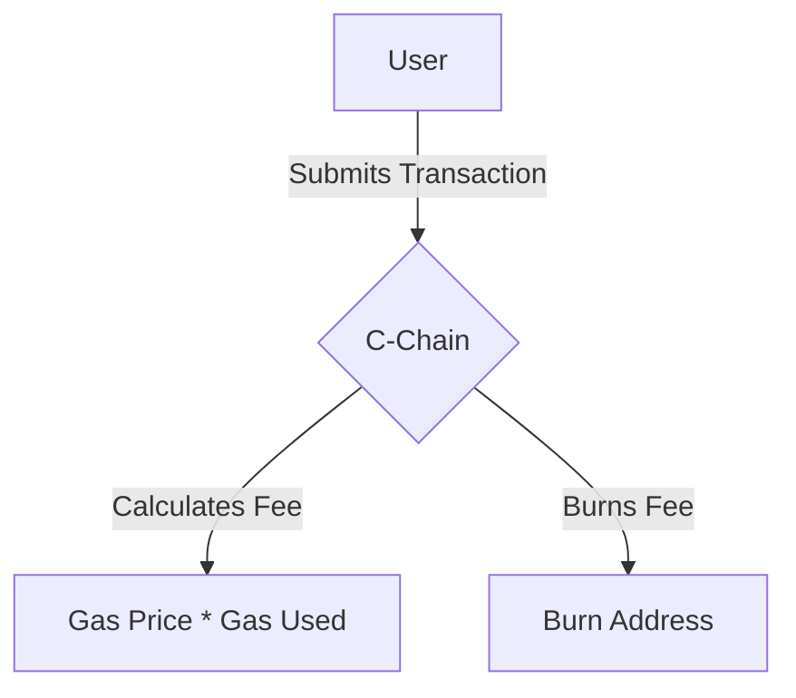

# Lesson 5: Tokenomics

**Goal:** To understand the role of the AVAX token in the Avalanche network, as well as the gas and fee mechanism, and the economic incentives that secure the network.

**Prerequisites:** A basic understanding of the Avalanche network.

**Estimated time:** 30 minutes

---

## Conceptual Explanation

The AVAX token is the native token of the Avalanche network. It is a utility token that is used to secure the network, pay for fees, and provide a basic unit of account between the multiple Subnets created on the Avalanche network.

### The AVAX Token

The AVAX token has a capped supply of 720 million tokens. Of these, 360 million were created in the genesis block, and the remaining 360 million will be minted over time as staking rewards. This means that the supply of AVAX is finite, and it will become scarcer over time.

The AVAX token is used for:

*   **Staking:** Validators must stake AVAX in order to participate in the consensus process.
*   **Fees:** Users must pay fees in AVAX in order to send transactions and deploy smart contracts.
*   **Governance:** The AVAX token will be used to vote on governance proposals.
*   **Incentives:** The AVAX token is used to incentivize users to participate in the network.

### Gas and Fees on the C-Chain

The C-Chain uses a gas and fee mechanism that is similar to the one used in Ethereum. Gas is used to measure the amount of computational resources that are required to execute a transaction, and fees are paid to the validators for processing the transaction.

However, there are a few key differences between the gas and fee mechanism on the C-Chain and the one on Ethereum. First, the C-Chain has a much higher gas limit than Ethereum, which means that it can process more complex transactions. Second, the C-Chain has a much lower gas price than Ethereum, which means that it is much cheaper to send transactions and deploy smart contracts on the C-Chain.

### Fee Mechanism and Burning

All fees on the Avalanche network are burned, which means that they are permanently removed from the circulating supply. This helps to reduce the supply of AVAX over time, which can help to increase its value.

The fee burning mechanism is a key part of the Avalanche tokenomics, and it is one of the things that makes AVAX a deflationary asset.

## Annotated Diagrams (Mermaid)

## Hands-on Lab

There is no hands-on lab for this lesson.

## Exercises

1.  What is the role of the AVAX token, and what are its four main uses?
2.  What is the capped supply of AVAX, and why is this important?
3.  How does the gas and fee mechanism on the C-Chain compare to the one on Ethereum?
4.  What is the fee burning mechanism, and why is it so important for the Avalanche tokenomics?

## Solutions

1.  The AVAX token is the native token of the Avalanche network, and its four main uses are staking, fees, governance, and incentives.
2.  The capped supply of AVAX is 720 million tokens, and this is important because it means that the supply of AVAX is finite, and it will become scarcer over time.
3.  The gas and fee mechanism on the C-Chain is similar to the one on Ethereum, but the C-Chain has a much higher gas limit and a much lower gas price.
4.  The fee burning mechanism is a mechanism where all fees on the Avalanche network are burned, which means that they are permanently removed from the circulating supply. It is so important for the Avalanche tokenomics because it helps to reduce the supply of AVAX over time, which can help to increase its value.

## References

*   [AVAX](https://docs.avax.network/learn/platform-overview#avax)
*   [Fees](https://docs.avax.network/learn/platform-overview#fees)
