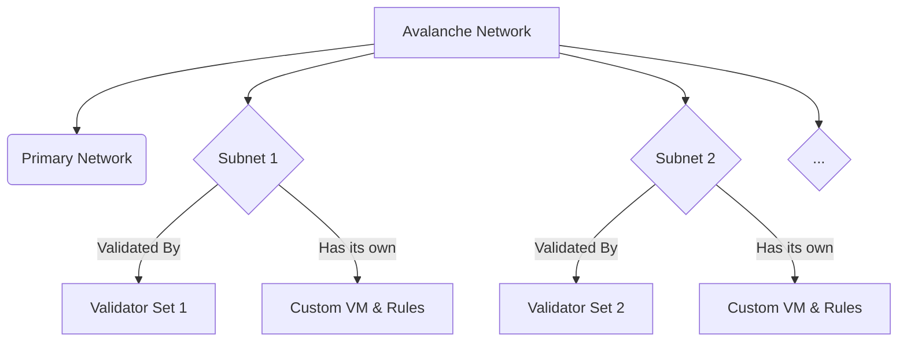

# Lesson 6: Introduction to Subnets

**Goal:** To understand what a Subnet is, the benefits of using a Subnet, and the use cases for Subnets, and how they are the key to Avalanche's scalability and customizability.

**Prerequisites:** A basic understanding of the Avalanche network.

**Estimated time:** 30 minutes

---

## Conceptual Explanation

A Subnet, or Subnetwork, is a dynamic set of validators working together to achieve consensus on the state of a set of blockchains. Each Subnet can have its own custom virtual machine (VM), consensus mechanism, and token model, making it possible to create a wide range of decentralized applications and services.

### The Benefits of Subnets

*   **Customizability:** Subnets are highly customizable, which means that developers can create blockchain networks that are tailored to their specific needs. For example, a developer could create a Subnet that is optimized for gaming, with a high transaction throughput and low latency. Or, a developer could create a Subnet that is optimized for DeFi, with a focus on security and compliance.
*   **Scalability:** Subnets are highly scalable, which means that they can support a large number of transactions per second. This is because each Subnet is validated by its own set of validators, which means that the performance of one Subnet is not affected by the performance of another Subnet.
*   **Interoperability:** Subnets are designed to be interoperable with other Subnets and with the primary network. This means that assets and data can be transferred between Subnets, and between Subnets and the primary network.
*   **Sovereignty:** Each Subnet has its own set of validators, which means that it is not dependent on the primary network for security. This gives developers a high degree of control over their own Subnet.

### Use Cases for Subnets

Subnets can be used to create a wide range of decentralized applications and services, including:

*   **Decentralized finance (DeFi):** Subnets can be used to create decentralized exchanges, lending platforms, and other DeFi applications.
*   **Gaming:** Subnets can be used to create decentralized games and other gaming applications.
*   **Non-fungible tokens (NFTs):** Subnets can be used to create decentralized marketplaces for NFTs.
*   **Enterprise applications:** Subnets can be used to create decentralized applications for enterprises, such as supply chain management and identity management.
*   **Private blockchains:** Subnets can be used to create private blockchains that are only accessible to a specific set of users.

## Annotated Diagrams (Mermaid)

## Hands-on Lab

There is no hands-on lab for this lesson.

## Exercises

1.  What is a Subnet, and how is it different from a traditional blockchain?
2.  What are the four main benefits of using a Subnet?
3.  What are some use cases for Subnets, and how can they be used to solve real-world problems?
4.  What is the relationship between a Subnet and the primary network?

## Solutions

1.  A Subnet is a dynamic set of validators working together to achieve consensus on the state of a set of blockchains. It is different from a traditional blockchain in that it is highly customizable, scalable, interoperable, and sovereign.
2.  The four main benefits of using a Subnet are customizability, scalability, interoperability, and sovereignty.
3.  Some use cases for Subnets are DeFi, gaming, NFTs, and enterprise applications. They can be used to solve real-world problems by providing a decentralized, secure, and scalable platform for building dApps.
4.  The relationship between a Subnet and the primary network is that the primary network is a special Subnet that is responsible for validating the entire Avalanche network. All other Subnets are validated by their own set of validators, but they are all connected to the primary network.

## References

*   [Subnets](https://docs.avax.network/learn/subnets/what-is-a-subnet)
*   [Subnet FAQ](https://docs.avax.network/learn/subnets/subnet-faq)
