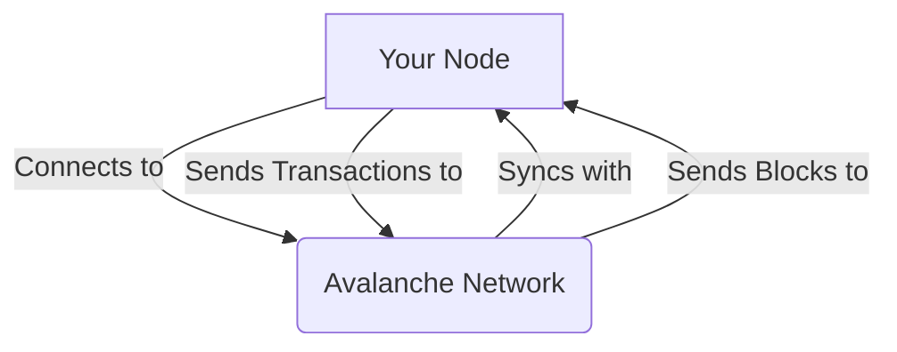

# Lesson 1: Setting Up a Node

**Goal:** To learn how to set up and run an AvalancheGo node, and to understand the different types of nodes and their roles in the network.

**Prerequisites:** A basic understanding of the Avalanche network.

**Estimated time:** 60 minutes

---

## Conceptual Explanation

Running an AvalancheGo node is a great way to get started with the Avalanche network. It allows you to connect to the network, send and receive transactions, and even become a validator.

### Types of Nodes

There are two main types of nodes in the Avalanche network:

*   **Full node:** A full node is a node that stores the entire history of the Avalanche network. Full nodes are responsible for validating transactions and adding new blocks to the blockchain.
*   **Archive node:** An archive node is a full node that also stores the historical state of the blockchain. Archive nodes are useful for developers who need to query the historical state of the blockchain.

### Hardware and Software Requirements

*   **Hardware:** 8 GB RAM, 4 vCPUs, 100 GB SSD
*   **Software:** Ubuntu 22.04 LTS (or other Linux distro with `glibc >= 2.31`)

### Installing and Configuring AvalancheGo

The easiest way to install AvalancheGo is to use the official installation script.

```bash
# Download the installation script
wget -nd -m https://raw.githubusercontent.com/ava-labs/avalanche-docs/master/scripts/avalanchego-installer.sh

# Run the installation script
bash avalanchego-installer.sh
```

### Syncing a Node with the Mainnet

Once you have installed AvalancheGo, you can start the node by running the following command:

```bash
# Start the node
/home/ubuntu/.avalanchego/build/avalanchego
```

The node will then begin to sync with the mainnet. This process can take several hours, so be patient. You can monitor the progress of the sync by checking the logs.

## Annotated Diagrams (Mermaid)



## Hands-on Lab

In this lab, we will install and run an AvalancheGo node on a local testnet.

1.  **Start a local testnet:**
    ```bash
    avalanche network start
    ```
2.  **Get the logs of one of the nodes:**
    ```bash
    avalanche network logs -n node1
    ```
3.  **Bootstrap a new node to the local testnet:**
    ```bash
    # Get the IP address of one of the nodes
    avalanche network status
    # Start a new node and point it to the existing network
    /home/ubuntu/.avalanchego/build/avalanchego --network-id=local --bootstrap-ips=<ip-address>:9651
    ```

## Exercises

1.  What are the two main types of nodes in the Avalanche network, and what are their roles?
2.  What are the hardware and software requirements for running an AvalancheGo node?
3.  How do you install AvalancheGo?
4.  How do you start an AvalancheGo node, and how do you monitor its progress?

## Solutions

1.  The two main types of nodes in the Avalanche network are full nodes and archive nodes. Full nodes are responsible for validating transactions and adding new blocks to the blockchain, while archive nodes are full nodes that also store the historical state of the blockchain.
2.  The hardware requirements are 8 GB RAM, 4 vCPUs, and 100 GB SSD. The software requirement is Ubuntu 22.04 LTS (or other Linux distro with `glibc >= 2.31`).
3.  You can install AvalancheGo by using the official installation script.
4.  You can start an AvalancheGo node by running the `/home/ubuntu/.avalanchego/build/avalanchego` command. You can monitor the progress of the sync by checking the logs.

## References

*   [Run an Avalanche Node](https://docs.avax.network/nodes/run/with-installer)
