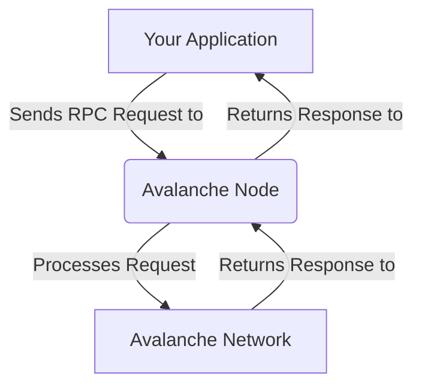

# Lesson 2: Interacting with the Network using RPC

**Goal:** To learn how to interact with the Avalanche network using the RPC, and to understand the different RPC endpoints and how to use them.

**Prerequisites:** A basic understanding of the Avalanche network and how to run a node.

**Estimated time:** 45 minutes

---

## Conceptual Explanation

The Avalanche network provides a JSON-RPC API that allows you to interact with the network programmatically. This is useful for building dApps, wallets, and other tools that need to interact with the Avalanche network.

### Querying the C-Chain, P-Chain, and X-Chain

You can use the RPC to query the C-Chain, P-Chain, and X-Chain. Each chain has its own set of RPC endpoints that you can use to query the state of the chain and send transactions.

*   **C-Chain:** The C-Chain has an RPC endpoint at `/ext/bc/C/rpc`. This endpoint is compatible with the Ethereum JSON-RPC API, which means that you can use the same tools and libraries that you use to interact with Ethereum to interact with the C-Chain.
*   **P-Chain:** The P-Chain has an RPC endpoint at `/ext/bc/P`. This endpoint provides a set of methods for interacting with the P-Chain, such as creating Subnets and staking AVAX.
*   **X-Chain:** The X-Chain has an RPC endpoint at `/ext/bc/X`. This endpoint provides a set of methods for interacting with the X-Chain, such as creating assets and sending transactions.

### Sending Transactions Programmatically

You can also use the RPC to send transactions programmatically. This is useful for building dApps that need to send transactions on behalf of users. To send a transaction, you need to create a signed transaction and then send it to the appropriate RPC endpoint.

## Annotated Diagrams (Mermaid)



## Hands-on Lab

In this lab, we will use `curl` to send RPC requests to a local testnet.

1.  **Start a local testnet:**
    ```bash
    avalanche network start
    ```
2.  **Get the latest block on the C-Chain:**
    ```bash
    curl -X POST --data '{
        "jsonrpc":"2.0",
        "id"     :1,
        "method" :"eth_blockNumber",
        "params" :[]
    }' -H 'content-type:application/json;' http://127.0.0.1:9650/ext/bc/C/rpc
    ```
3.  **Get the balance of the default address on the X-Chain:**
    ```bash
    curl -X POST --data '{
        "jsonrpc":"2.0",
        "id"     :1,
        "method" :"avm.getBalance",
        "params" :{"address":"X-local18jma8ppw3nhx5r4ap8clazz0dps7rv5u00z96u","assetID":"AVAX"}
    }' -H 'content-type:application/json;' http://127.0.0.1:9650/ext/bc/X
    ```
4.  **Get the validators on the P-Chain:**
    ```bash
    curl -X POST --data '{
        "jsonrpc":"2.0",
        "id"     :1,
        "method" :"platform.getCurrentValidators",
        "params" :{}
    }' -H 'content-type:application/json;' http://127.0.0.1:9650/ext/bc/P
    ```

## Exercises

1.  What is the RPC, and why is it so useful for developers?
2.  What are the different RPC endpoints for the C-Chain, P-Chain, and X-Chain?
3.  How can you use the RPC to query the C-Chain, and what makes it so easy for Ethereum developers?
4.  How can you use the RPC to send transactions programmatically?

## Solutions

1.  The RPC is a JSON-RPC API that allows you to interact with the Avalanche network programmatically. It is so useful for developers because it allows them to build dApps, wallets, and other tools that need to interact with the Avalanche network.
2.  The different RPC endpoints for the C-Chain, P-Chain, and X-Chain are `/ext/bc/C/rpc`, `/ext/bc/P`, and `/ext/bc/X`, respectively.
3.  You can use the RPC to query the C-Chain by sending RPC requests to the C-Chain's RPC endpoint. It is so easy for Ethereum developers because the C-Chain's RPC endpoint is compatible with the Ethereum JSON-RPC API.
4.  You can use the RPC to send transactions programmatically by creating a signed transaction and then sending it to the appropriate RPC endpoint.

## References

*   [Avalanche API](https://docs.avax.network/reference/avalanchego-api)
