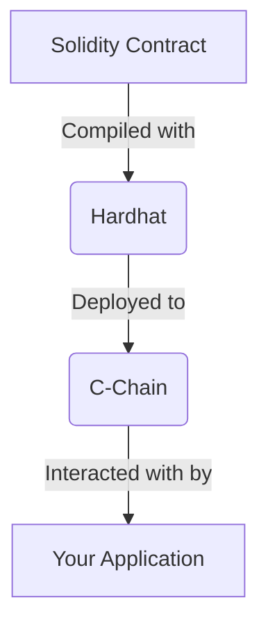

# Lesson 3: Deploying Smart Contracts to the C-Chain

**Goal:** To learn how to deploy smart contracts to the Avalanche C-Chain, and to understand the differences between deploying to the C-Chain and deploying to Ethereum.

**Prerequisites:** A basic understanding of Solidity and the Ethereum toolchain.

**Estimated time:** 60 minutes

---

## Conceptual Explanation

The Avalanche C-Chain is a fully compatible EVM chain, which means that you can use the same tools and workflows that you are familiar with to build and deploy dApps on the C-Chain. However, there are a few key differences between deploying to the C-Chain and deploying to Ethereum.

### Configuring a Development Environment

To get started, you will need to configure a development environment. We recommend using the Hardhat development environment, which is a popular choice for Ethereum developers. You will also need to install the Avalanche-CLI, which you can use to create a local testnet.

### Writing and Compiling a Solidity Contract

Once you have configured your development environment, you can start writing and compiling your Solidity contract. For this lesson, we will use a simple "Hello, World" contract.

### Deploying and Interacting with a Contract on the C-Chain

Once you have compiled your contract, you can deploy it to the C-Chain. After it has been deployed, you can interact with it using the Hardhat console. The process of deploying and interacting with a contract on the C-Chain is very similar to the process of deploying and interacting with a contract on Ethereum. The main difference is that you will need to configure Hardhat to connect to the C-Chain instead of Ethereum.

## Annotated Diagrams (Mermaid)



## Hands-on Lab

In this lab, we will use Hardhat to deploy a "Hello, World" contract to a local testnet.

1.  **Start a local testnet:**
    ```bash
    avalanche network start
    ```
2.  **Create a new Hardhat project:**
    ```bash
    npx hardhat
    ```
3.  **Install the Hardhat toolbox and dotenv:**
    ```bash
    npm install --save-dev @nomicfoundation/hardhat-toolbox dotenv
    ```
4.  **Create a new contract:**
    ```solidity
    // contracts/HelloWorld.sol
    pragma solidity ^0.8.0;

    contract HelloWorld {
        function sayHello() public pure returns (string memory) {
            return "Hello, World!";
        }
    }
    ```
5.  **Create a deployment script:**
    ```javascript
    // scripts/deploy.js
    async function main() {
        const HelloWorld = await ethers.getContractFactory("HelloWorld");
        const helloWorld = await HelloWorld.deploy();
        console.log("HelloWorld deployed to:", helloWorld.address);
    }

    main()
        .then(() => process.exit(0))
        .catch(error => {
            console.error(error);
            process.exit(1);
        });
    ```
6.  **Create a `.env` file and add your private key:**
    ```
    PRIVATE_KEY=<your-private-key>
    ```
7.  **Configure Hardhat for the local testnet:**
    ```javascript
    // hardhat.config.js
    require("@nomicfoundation/hardhat-toolbox");
    require("dotenv").config();

    module.exports = {
        solidity: "0.8.0",
        networks: {
            local: {
                url: "http://127.0.0.1:9650/ext/bc/C/rpc",
                accounts: [process.env.PRIVATE_KEY]
            }
        }
    };
    ```
8.  **Deploy the contract:**
    ```bash
    npx hardhat run scripts/deploy.js --network local
    ```
9.  **Interact with the contract:**
    ```bash
    npx hardhat console --network local
    > const HelloWorld = await ethers.getContractFactory("HelloWorld");
    > const helloWorld = await HelloWorld.attach("<your-contract-address>");
    > await helloWorld.sayHello();
    ```

## Exercises

1.  What is the C-Chain, and why is it so easy for Ethereum developers to use?
2.  What are the key differences between deploying to the C-Chain and deploying to Ethereum?
3.  How do you configure Hardhat to connect to the C-Chain?
4.  How do you interact with a contract on the C-Chain using the Hardhat console?

## Solutions

1.  The C-Chain is a fully compatible EVM chain, and it is so easy for Ethereum developers to use because it is compatible with the Ethereum toolchain.
2.  The key differences between deploying to the C-Chain and deploying to Ethereum are that you need to configure Hardhat to connect to the C-Chain instead of Ethereum, and the gas fees are much lower on the C-Chain.
3.  You can configure Hardhat to connect to the C-Chain by setting the `url` and `accounts` in the `hardhat.config.js` file.
4.  You can interact with a contract on the C-Chain using the Hardhat console by attaching to the contract and then calling its methods.

## References

*   [Deploy a Smart Contract on Avalanche Using Remix and Core](https://docs.avax.network/build/dapp/smart-contracts/deploy-a-smart-contract-on-avalanche-using-remix-and-core)
