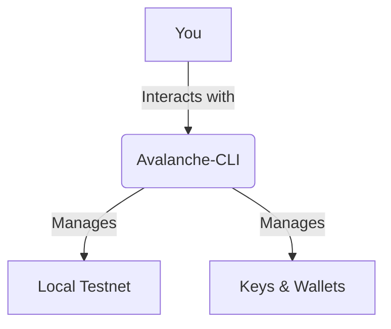

# Lesson 4: Introduction to Avalanche-CLI

**Goal:** To learn how to use the Avalanche-CLI to manage local testnets, keys, and wallets, and to understand how it can be used to streamline the development and testing process.

**Prerequisites:** A basic understanding of the Avalanche network.

**Estimated time:** 45 minutes

---

## Conceptual Explanation

The Avalanche-CLI is a command-line tool that makes it easy to manage local testnets, keys, and wallets. It is a powerful tool that can be used to streamline the development and testing process.

### Installing and Configuring the Avalanche-CLI

The Avalanche-CLI can be installed using npm.

```bash
npm install -g @avalabs/avalanche-cli
```

### Creating a Local Testnet

You can use the Avalanche-CLI to create a local testnet with a single command.

```bash
avalanche network start
```

This will start a five-node local testnet that you can use for development and testing. The testnet will be pre-funded with AVAX, so you can start deploying and testing your contracts right away.

### Managing Keys and Wallets

You can use the Avalanche-CLI to create and manage keys and wallets.

```bash
# Create a new key
avalanche key create mykey

# List the keys in your wallet
avalanche key list

# Export a key
avalanche key export mykey

# Import a key
avalanche key import mykey
```

## Annotated Diagrams (Mermaid)



## Hands-on Lab

In this lab, we will use the Avalanche-CLI to create a local testnet and a new wallet.

1.  **Start a local testnet:**
    ```bash
    avalanche network start
    ```
2.  **Create a new wallet:**
    ```bash
    avalanche key create mywallet
    ```
3.  **Check the balance of your new wallet:**
    ```bash
    avalanche wallet balance --wallet mywallet
    ```
4.  **Send funds from the default wallet to your new wallet:**
    ```bash
    avalanche transaction transfer --from default --to mywallet --amount 100 --asset AVAX
    ```

## Exercises

1.  What is the Avalanche-CLI, and what are its main features?
2.  How do you install the Avalanche-CLI?
3.  How do you create a local testnet using the Avalanche-CLI, and what are the benefits of doing so?
4.  How do you manage keys and wallets using the Avalanche-CLI?

## Solutions

1.  The Avalanche-CLI is a command-line tool that makes it easy to manage local testnets, keys, and wallets. Its main features are the ability to create and manage local testnets, the ability to create and manage keys and wallets, and the ability to send transactions.
2.  You can install the Avalanche-CLI using npm.
3.  You can create a local testnet using the `avalanche network start` command. The benefits of doing so are that you can develop and test your contracts in a local environment without having to deploy them to a public testnet.
4.  You can manage keys and wallets using the `avalanche key` and `avalanche wallet` commands.

## References

*   [Avalanche-CLI](https://github.com/ava-labs/avalanche-cli)
