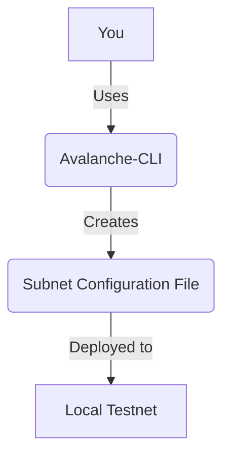

# Lesson 5: Creating a Custom Subnet

**Goal:** To learn how to create a custom Subnet using the Avalanche-CLI, and to understand the different types of Subnets and their use cases.

**Prerequisites:** A basic understanding of the Avalanche network and the Avalanche-CLI.

**Estimated time:** 60 minutes

---

## Conceptual Explanation

A Subnet is a custom blockchain network that is created by developers to support their specific use cases. Subnets can have their own custom virtual machines (VMs), consensus mechanisms, and token models, making it possible to create a wide range of decentralized applications and services.

### Using the Avalanche-CLI to Create a Subnet

The Avalanche-CLI makes it easy to create and deploy Subnets. You can use the `avalanche subnet create` command to create a new Subnet configuration file.

```bash
avalanche subnet create mySubnet --vm Subnet-EVM
```

This will create a `subnets/mySubnet.json` file that defines your Subnet.

### Types of Subnets

There are two main types of Subnets:

*   **EVM Subnets:** EVM Subnets are Subnets that are compatible with the Ethereum Virtual Machine (EVM). This means that you can use the same tools and workflows that you are familiar with to build and deploy dApps on an EVM Subnet.
*   **Custom Subnets:** Custom Subnets are Subnets that use a custom virtual machine (VM). This gives you a high degree of control over your Subnet, but it also requires you to build your own VM.

### Deploying a Subnet to a Local Testnet

Once you have created your Subnet configuration file, you can deploy it to a local testnet using the `avalanche subnet deploy` command.

```bash
avalanche subnet deploy mySubnet --network local
```

### Adding Validators to a Subnet

By default, the Subnet will be validated by the five nodes in the local testnet. You can add additional validators to the Subnet by using the `avalanche subnet addValidator` command.

## Annotated Diagrams (Mermaid)



## Hands-on Lab

In this lab, we will use the Avalanche-CLI to create and deploy a custom Subnet.

1.  **Start a local testnet:**
    ```bash
    avalanche network start
    ```
2.  **Create a new Subnet configuration file:**
    ```bash
    avalanche subnet create myCustomSubnet --vm Subnet-EVM
    ```
3.  **Deploy the Subnet to the local testnet:**
    ```bash
    avalanche subnet deploy myCustomSubnet --network local
    ```
4.  **Check the status of the Subnet:**
    ```bash
    avalanche subnet status myCustomSubnet --network local
    ```
5.  **Add your wallet to the Subnet:**
    ```bash
    avalanche wallet add myCustomSubnet
    ```

## Exercises

1.  What is a Subnet, and what are the benefits of creating a custom Subnet?
2.  What are the two main types of Subnets, and what are their use cases?
3.  How do you create a Subnet using the Avalanche-CLI?
4.  How do you deploy a Subnet to a local testnet, and how do you add your wallet to the Subnet?

## Solutions

1.  A Subnet is a custom blockchain network that is created by developers to support their specific use cases. The benefits of creating a custom Subnet are that you can customize the VM, the consensus mechanism, and the token model to meet your specific needs.
2.  The two main types of Subnets are EVM Subnets and custom Subnets. EVM Subnets are used for building dApps that are compatible with the Ethereum toolchain, while custom Subnets are used for building dApps that require a high degree of control over the VM.
3.  You can create a Subnet using the `avalanche subnet create` command.
4.  You can deploy a Subnet to a local testnet using the `avalanche subnet deploy` command. You can add your wallet to the Subnet using the `avalanche wallet add` command.

## References

*   [Create a Subnet](https://docs.avax.network/build/subnet/create-a-local-subnet)
