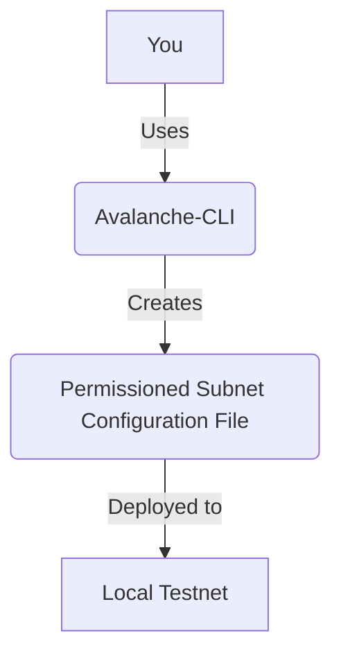

# Lesson 6: Subnet Permissioning and Customization

**Goal:** To learn how to create a permissioned Subnet, customize the genesis file, and configure the gas and fee mechanism.

**Prerequisites:** A basic understanding of Subnets and the Avalanche-CLI.

**Estimated time:** 60 minutes

---

## Conceptual Explanation

Subnets are highly customizable, which means that you can create a Subnet that is tailored to your specific needs. You can create a permissioned Subnet, which means that only certain validators are allowed to join the Subnet. You can also customize the genesis file, which allows you to control the initial state of the Subnet. And you can configure the gas and fee mechanism, which allows you to control the cost of transactions on your Subnet.

### Creating a Permissioned Subnet

To create a permissioned Subnet, you need to add the `--permissioned` flag to the `avalanche subnet create` command.

```bash
avalanche subnet create myPermissionedSubnet --vm Subnet-EVM --permissioned
```

This will create a new Subnet configuration file with the `permissioned` flag set to `true`. When you deploy a permissioned Subnet, you will need to specify a list of whitelisted validators. Only these validators will be allowed to join the Subnet.

### Customizing the Genesis File

The genesis file is a JSON file that defines the initial state of the Subnet. You can customize the genesis file to control the initial allocation of tokens, the initial set of validators, and other parameters.

### Configuring Gas and Fees for a Subnet

You can also configure the gas and fee mechanism for your Subnet. This allows you to control the cost of transactions on your Subnet. You can set the gas limit, the gas price, and the fee recipient.

## Annotated Diagrams (Mermaid)



## Hands-on Lab

In this lab, we will create a permissioned Subnet and customize the genesis file.

1.  **Start a local testnet:**
    ```bash
    avalanche network start
    ```
2.  **Create a new permissioned Subnet:**
    ```bash
    avalanche subnet create myPermissionedSubnet --vm Subnet-EVM --permissioned
    ```
3.  **Open the genesis file and add a new funded address:**
    ```json
    // subnets/myPermissionedSubnet_genesis.json
    {
        "config": {
            ...
        },
        "alloc": {
            "0x8db97C7cEcE249c2b98bDC0226Cc4C2A57BF52FC": {
                "balance": "0x295BE96E64066972000000"
            }
        },
        ...
    }
    ```
4.  **Whitelist a validator:**
    ```bash
    avalanche subnet addValidator myPermissionedSubnet --nodeID NodeID-7Xhw2mDxuDS44j42TCB6U5579esbSt3Lg
    ```
5.  **Deploy the Subnet to the local testnet:**
    ```bash
    avalanche subnet deploy myPermissionedSubnet --network local
    ```

## Exercises

1.  What is a permissioned Subnet, and what are the benefits of creating one?
2.  How do you create a permissioned Subnet using the Avalanche-CLI?
3.  What is the genesis file, and what are some of the things you can customize in it?
4.  How do you configure the gas and fee mechanism for a Subnet?

## Solutions

1.  A permissioned Subnet is a Subnet that only allows certain validators to join. The benefits of creating one are that you can control who is allowed to validate your Subnet, which can be useful for enterprise applications.
2.  You can create a permissioned Subnet by adding the `--permissioned` flag to the `avalanche subnet create` command.
3.  The genesis file is a JSON file that defines the initial state of the Subnet. Some of the things you can customize in it are the initial allocation of tokens, the initial set of validators, and the gas and fee mechanism.
4.  You can configure the gas and fee mechanism for a Subnet by customizing the genesis file.

## References

*   [Subnet Configurations](https://docs.avax.network/build/subnet/create-a-local-subnet#subnet-configurations)
