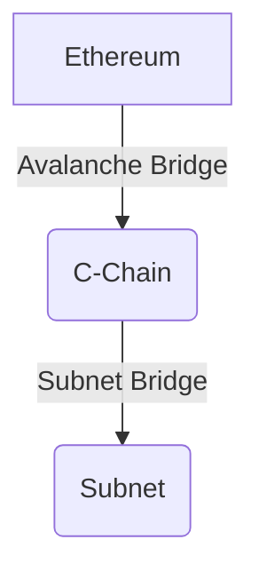

# Lesson 7: Bridging Assets

**Goal:** To learn how to bridge assets between Ethereum and the C-Chain, and between the C-Chain and a Subnet, and to understand the different types of bridges and their use cases.

**Prerequisites:** A basic understanding of the Avalanche network and Subnets.

**Estimated time:** 60 minutes

---

## Conceptual Explanation

The Avalanche network is designed to be interoperable with other blockchain networks. This is achieved through the use of bridges, which allow for the transfer of assets and data between different blockchain networks.

### Introduction to the Avalanche Bridge

The Avalanche Bridge is a trustless bridge that allows for the transfer of assets between Ethereum and the C-Chain. It is a fast, secure, and low-cost way to move assets between the two networks. The bridge is secured by a set of wardens who are responsible for monitoring the bridge and ensuring that all transactions are processed correctly.

### Bridging Assets between Ethereum and the C-Chain

To bridge assets from Ethereum to the C-Chain, you need to send your assets to a specific Ethereum address. The bridge will then mint a corresponding amount of wrapped assets on the C-Chain. The wrapped assets will have the same value as the original assets, and they can be used in dApps on the C-Chain.

### Bridging Assets to a Subnet

You can also bridge assets from the C-Chain to a Subnet. This is useful for building dApps that need to use assets from other blockchain networks. To bridge assets to a Subnet, you need to use a tool like the Avalanche-CLI.

## Annotated Diagrams (Mermaid)



## Hands-on Lab

In this lab, we will use the Avalanche Bridge to bridge assets from a local Ethereum testnet to a local Avalanche testnet.

1.  **Start a local testnet:**
    ```bash
    avalanche network start
    ```
2.  **Create a new Subnet:**
    ```bash
    avalanche subnet create myBridgedSubnet --vm Subnet-EVM
    ```
3.  **Deploy the Subnet to the local testnet:**
    ```bash
    avalanche subnet deploy myBridgedSubnet --network local
    ```
4.  **Bridge assets from the C-Chain to the Subnet:**
    ```bash
    avalanche transaction bridge --from C --to myBridgedSubnet --amount 1 --asset AVAX
    ```

## Exercises

1.  What is the Avalanche Bridge, and how does it work?
2.  What are the benefits of using the Avalanche Bridge?
3.  How do you bridge assets from Ethereum to the C-Chain?
4.  How do you bridge assets to a Subnet, and why is this useful for dApp developers?

## Solutions

1.  The Avalanche Bridge is a trustless bridge that allows for the transfer of assets between Ethereum and the C-Chain. It works by locking up assets on one chain and minting a corresponding amount of wrapped assets on the other chain.
2.  The benefits of using the Avalanche Bridge are that it is fast, secure, and low-cost.
3.  You can bridge assets from Ethereum to the C-Chain by sending your assets to a specific Ethereum address.
4.  You can bridge assets to a Subnet by using the `avalanche transaction bridge` command. This is useful for dApp developers because it allows them to use assets from other blockchain networks in their dApps.

## References

*   [Avalanche Bridge](https://www.avax.network/bridge)
*   [Bridge Assets to a Subnet](https://docs.avax.network/build/subnet/deploy-a-smart-contract-on-your-subnet#bridging-assets-to-the-subnet)
