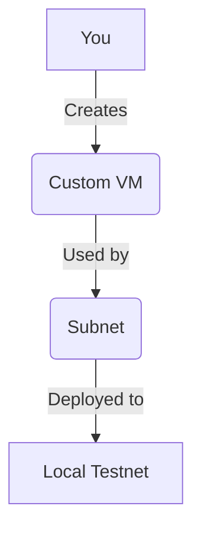

# Lesson 1: Custom Virtual Machines (VMs)

**Goal:** To learn how to create a custom virtual machine (VM) for a Subnet, and to understand the benefits of using a custom VM.

**Prerequisites:** A basic understanding of Subnets and the Avalanche-CLI. A strong understanding of Go is recommended.

**Estimated time:** 90 minutes

---

## Conceptual Explanation

A virtual machine (VM) is a program that defines the application-level logic of a blockchain. It is responsible for managing the state of the blockchain, processing transactions, and executing smart contracts.

### Introduction to Subnet-EVM

The Subnet-EVM is a custom VM that is designed to be used with Subnets. It is a fully compatible EVM chain, which means that you can use the same tools and workflows that you are familiar with to build and deploy dApps on a Subnet-EVM chain. The Subnet-EVM is the easiest way to get started with custom VMs, and it is a good choice for most use cases.

### Building and Deploying a Custom VM

You can build and deploy a custom VM by using the Avalanche-CLI. The `avalanche subnet create` command allows you to specify a custom VM to use for your Subnet. To build a custom VM, you will need to write your own VM in Go. This is a complex process, but it gives you a high degree of control over your Subnet.

### Creating a TimestampVM

The TimestampVM is a simple VM that is used to demonstrate how to build a custom VM. It is a good starting point for learning how to build your own custom VMs. The TimestampVM is a simple key-value store that allows you to store and retrieve timestamps.

## Annotated Diagrams (Mermaid)



## Hands-on Lab

In this lab, we will create a custom VM by forking the Subnet-EVM, and then deploy it to a local testnet.

1.  **Clone the Subnet-EVM repository:**
    ```bash
    git clone https://github.com/ava-labs/subnet-evm.git
    ```
2.  **Make a minor change to the Subnet-EVM binary:**
    ```bash
    cd subnet-evm
    git commit -a --allow-empty -m "custom vm commit"
    ```
3.  **Build the custom binary:**
    ```bash
    ./scripts/build.sh custom_vm.bin
    ```
4.  **Create a custom genesis file:**
    ```json
    // custom_genesis.json
    {
        "config": {
            "chainId": 1337,
            "homesteadBlock": 0,
            "eip150Block": 0,
            "eip155Block": 0,
            "eip158Block": 0,
            "byzantiumBlock": 0,
            "constantinopleBlock": 0,
            "petersburgBlock": 0,
            "istanbulBlock": 0,
            "berlinBlock": 0,
            "londonBlock": 0,
            "feeConfig": {
                "gasLimit": 8000000,
                "minBaseFee": 25000000000,
                "targetGas": 15000000,
                "baseFeeChangeDenominator": 36,
                "minBlockGasCost": 0,
                "maxBlockGasCost": 1000000,
                "targetBlockRate": 2,
                "blockGasCostStep": 200000
            }
        },
        "alloc": {
            "8db97C7cEcE249c2b98bDC0226Cc4C2A57BF52FC": {
                "balance": "0x295BE96E64066972000000"
            }
        },
        "nonce": "0x0",
        "timestamp": "0x0",
        "extraData": "0x",
        "gasLimit": "0x7A1200",
        "difficulty": "0x0",
        "mixHash": "0x0000000000000000000000000000000000000000000000000000000000000000",
        "coinbase": "0x0000000000000000000000000000000000000000"
    }
    ```
5.  **Create a new Subnet with the custom VM:**
    ```bash
    avalanche subnet create myCustomVMSubnet --vm custom_vm.bin --genesis custom_genesis.json
    ```
6.  **Deploy the Subnet to the local testnet:**
    ```bash
    avalanche subnet deploy myCustomVMSubnet --network local
    ```
7.  **Check the version of the custom VM:**
    ```bash
    curl --location --request POST 'http://127.0.0.1:9650/ext/info' \
    --header 'Content-Type: application/json' \
    --data-raw '{
        "jsonrpc":"2.0",
        "id"     :1,
        "method" :"info.getNodeVersion",
        "params" :{
        }
    }'
    ```

## Exercises

1.  What is a virtual machine (VM), and what is its role in a blockchain?
2.  What is the Subnet-EVM, and why is it a good choice for most use cases?
3.  What are the benefits of building your own custom VM?
4.  What is the TimestampVM, and why is it a good starting point for learning how to build custom VMs?

## Solutions

1.  A virtual machine (VM) is a program that defines the application-level logic of a blockchain. It is responsible for managing the state of the blockchain, processing transactions, and executing smart contracts.
2.  The Subnet-EVM is a custom VM that is designed to be used with Subnets. It is a good choice for most use cases because it is a fully compatible EVM chain, which means that you can use the same tools and workflows that you are familiar with to build and deploy dApps on a Subnet-EVM chain.
3.  The benefits of building your own custom VM are that you have a high degree of control over your Subnet. You can customize the state model, the transaction format, and the fee mechanism to meet your specific needs.
4.  The TimestampVM is a simple VM that is used to demonstrate how to build a custom VM. It is a good starting point for learning how to build your own custom VMs because it is a simple key-value store that is easy to understand.

## References

*   [Create a Virtual Machine (VM)](https://docs.avax.network/build/vm/create-a-vm-subnet-evm)
