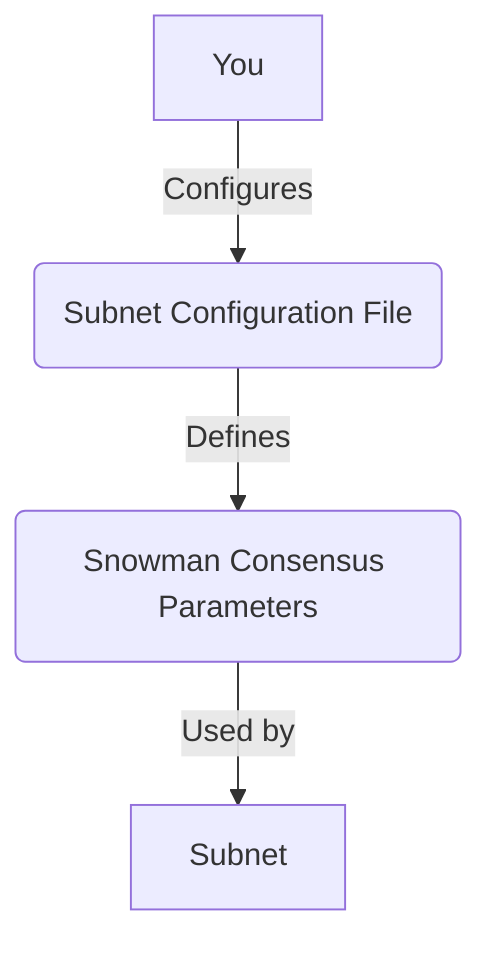

# Lesson 2: Consensus Tuning

**Goal:** To learn how to customize the Snowman consensus parameters to optimize for performance and security, and to understand the trade-offs between different consensus configurations.

**Prerequisites:** A basic understanding of the Avalanche consensus mechanism and Subnets.

**Estimated time:** 60 minutes

---

## Conceptual Explanation

The Snowman consensus protocol is a highly customizable protocol that allows you to tune the consensus parameters to optimize for performance and security. You can adjust the sample size, the quorum size, and the decision threshold to control the trade-off between performance and security.

### Customizing the Snowman Consensus Parameters

The Snowman consensus parameters can be customized in the Subnet configuration file. The following parameters can be adjusted:

*   **k (sample size):** This is the number of validators that each validator polls in each round of consensus. A larger sample size will increase the security of the network, but it will also increase the latency of the network.
*   **alpha (quorum size):** This is the number of validators that must agree on a transaction before it can be accepted. A larger quorum size will increase the security of the network, but it will also increase the latency of the network.
*   **beta1 (virtuous commit threshold):** This is the number of consecutive successful polls required to accept a transaction. A larger beta1 will increase the security of the network, but it will also increase the latency of the network.
*   **beta2 (rogue commit threshold):** This is the number of consecutive successful polls required to accept a transaction with a conflicting transaction. A larger beta2 will increase the security of the network,.
but it will also increase the latency of the network.

### Optimizing for Performance and Security

By adjusting the consensus parameters, you can optimize for performance and security. For example, if you are building a high-performance application that requires low latency, you might want to use a smaller sample size and a smaller quorum size. However, if you are building a high-security application that requires a high degree of decentralization, you might want to use a larger sample size and a larger quorum size.

## Annotated Diagrams (Mermaid)



## Hands-on Lab

In this lab, we will customize the Snowman consensus parameters for a Subnet.

1.  **Start a local testnet:**
    ```bash
    avalanche network start
    ```
2.  **Create a new Subnet:**
    ```bash
    avalanche subnet create myTunedSubnet --vm Subnet-EVM
    ```
3.  **Open the Subnet configuration file and adjust the consensus parameters:**
    ```json
    // subnets/myTunedSubnet.json
    {
        ...
        "consensus": {
            "k": 10,
            "alpha": 8,
            "beta1": 15,
            "beta2": 20
        },
        ...
    }
    ```
4.  **Deploy the Subnet to the local testnet:**
    ```bash
    avalanche subnet deploy myTunedSubnet --network local
    ```

## Exercises

1.  What is the Snowman consensus protocol, and what are the four consensus parameters that can be adjusted?
2.  What is the trade-off between performance and security when it comes to consensus tuning?
3.  How can you optimize for performance, and how can you optimize for security?
4.  What are some use cases for a high-performance Subnet, and what are some use cases for a high-security Subnet?

## Solutions

1.  The Snowman consensus protocol is a highly customizable protocol that is used in the Avalanche network. The four consensus parameters that can be adjusted are k, alpha, beta1, and beta2.
2.  The trade-off between performance and security when it comes to consensus tuning is that a more secure network will have a higher latency, and a more performant network will have a lower security.
3.  You can optimize for performance by using a smaller sample size and a smaller quorum size. You can optimize for security by using a larger sample size and a larger quorum size.
4.  Some use cases for a high-performance Subnet are gaming and decentralized exchanges. Some use cases for a high-security Subnet are enterprise applications and financial applications.

## References

*   [Snowman Consensus](https://docs.avax.network/learn/platform-overview#snowman-consensus)
