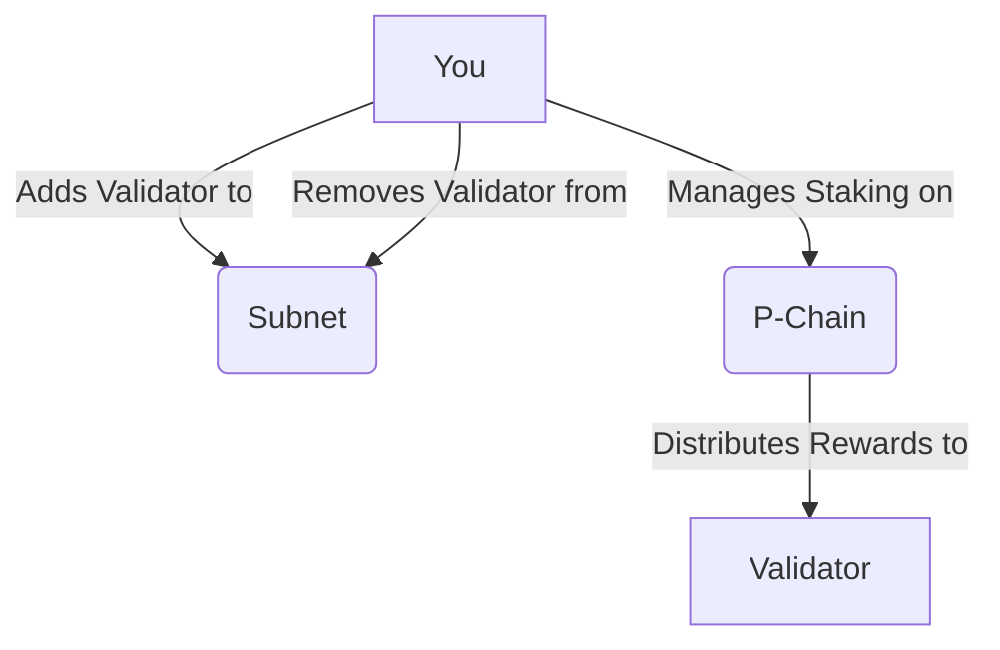

# Lesson 3: Validator Lifecycle Management

**Goal:** To learn how to add and remove validators from a Subnet, manage staking and rewards, and understand the role of the P-Chain in validator lifecycle management.

**Prerequisites:** A basic understanding of Subnets and validators.

**Estimated time:** 60 minutes

---

## Conceptual Explanation

Validators are responsible for securing a Subnet and processing transactions. As a Subnet operator, you will need to manage the lifecycle of your validators, which includes adding and removing validators, as well as managing staking and rewards.

### Adding and Removing Validators from a Subnet

You can add and remove validators from a Subnet by using the `avalanche subnet addValidator` and `avalanche subnet removeValidator` commands. When you add a validator to a Subnet, you are giving that validator permission to validate the Subnet. When you remove a validator from a Subnet, you are revoking that permission.

### Managing Staking and Rewards

You can manage staking and rewards by using the P-Chain. The P-Chain is responsible for coordinating validators and managing Subnets. To become a validator, you must stake a certain amount of AVAX on the P-Chain. In return for staking your AVAX, you will earn rewards, which are paid out in AVAX.

### The ValidatorManager Contract

The `ValidatorManager` contract is a pre-compiled contract that is used to manage the lifecycle of validators on a Subnet. It provides a set of functions for adding, removing, and updating validators.

## Annotated Diagrams (Mermaid)



## Hands-on Lab

In this lab, we will add and remove a validator from a Subnet.

1.  **Start a local testnet:**
    ```bash
    avalanche network start
    ```
2.  **Create a new Subnet:**
    ```bash
    avalanche subnet create myManagedSubnet --vm Subnet-EVM
    ```
3.  **Deploy the Subnet to the local testnet:**
    ```bash
    avalanche subnet deploy myManagedSubnet --network local
    ```
4.  **Get the ID of one of the nodes:**
    ```bash
    avalanche network status
    ```
    Copy the `NodeID` of one of the nodes from the output.
5.  **Add a validator to the Subnet:**
    ```bash
    avalanche subnet addValidator myManagedSubnet --nodeID <NodeID>
    ```
6.  **Remove a validator from the Subnet:**
    ```bash
    avalanche subnet removeValidator myManagedSubnet --nodeID <NodeID>
    ```

## Exercises

1.  What are the responsibilities of a validator, and why is it important to manage their lifecycle?
2.  How do you add and remove a validator from a Subnet, and what is the role of the P-Chain in this process?
3.  How do you manage staking and rewards, and what are the economic incentives for being a validator?
4.  What are some of the challenges of managing a Subnet with a large number of validators?

## Solutions

1.  Validators are responsible for securing a Subnet and processing transactions. It is important to manage their lifecycle to ensure that the Subnet is secure and that it is running smoothly.
2.  You can add and remove a validator from a Subnet by using the `avalanche subnet addValidator` and `avalanche subnet removeValidator` commands. The P-Chain is responsible for coordinating validators and managing Subnets.
3.  You can manage staking and rewards by using the P-Chain. The economic incentives for being a validator are that you can earn rewards in AVAX.
4.  Some of the challenges of managing a Subnet with a large number of validators are that it can be difficult to coordinate the validators, and it can be difficult to ensure that all of the validators are behaving honestly.

## References

*   [Add a Validator to a Subnet](https://docs.avax.network/build/subnet/add-a-validator-to-a-subnet)
