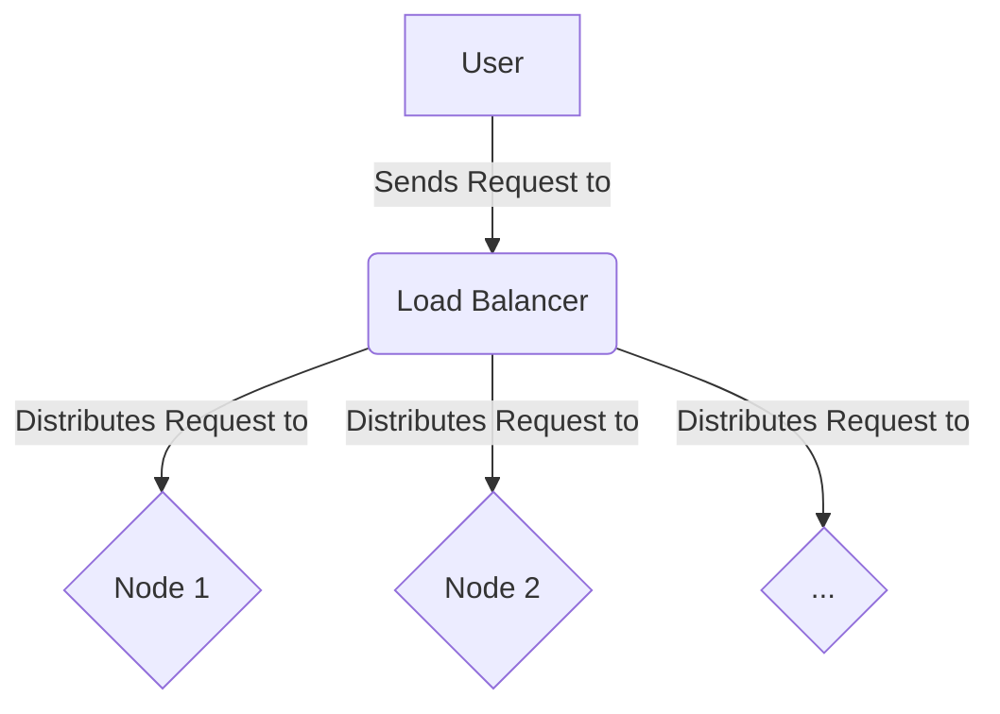

# Lesson 4: Scaling Subnets

**Goal:** To learn techniques for scaling a Subnet, including load balancing and high availability.

**Prerequisites:** A basic understanding of Subnets and validators.

**Estimated time:** 45 minutes

---

## Conceptual Explanation

As your Subnet grows, you will need to scale it to meet the demands of your users. There are a number of techniques that you can use to scale your Subnet, including load balancing and high availability.

### Techniques for Scaling a Subnet

*   **Load balancing:** Load balancing is the process of distributing traffic across multiple nodes in a Subnet. This can help to improve the performance and reliability of your Subnet.
*   **High availability:** High availability is the process of ensuring that your Subnet is always available to your users. This can be achieved by using redundant nodes and by implementing a failover mechanism.

### Load Balancing and High Availability

There are a number of tools that you can use to implement load balancing and high availability, including:

*   **Kubernetes:** Kubernetes is a container orchestration platform that can be used to manage and scale your Subnet.
*   **Helm:** Helm is a package manager for Kubernetes that can be used to deploy and manage your Subnet.

## Annotated Diagrams (Mermaid)



## Hands-on Lab

In this lab, we will use a simple load balancer to distribute traffic across multiple nodes in a local testnet.

1.  **Start a local testnet with three nodes:**
    ```bash
    avalanche network start --nodes 3
    ```
2.  **Install a simple load balancer, like `nginx`:**
    ```bash
    sudo apt-get install nginx
    ```
3.  **Configure `nginx` to load balance traffic between the three nodes:**
    ```nginx
    # /etc/nginx/sites-available/default
    upstream avalanche {
        server 127.0.0.1:9650;
        server 127.0.0.1:9652;
        server 127.0.0.1:9654;
    }

    server {
        listen 80;
        location / {
            proxy_pass http://avalanche;
        }
    }
    ```
4.  **Restart `nginx`:**
    ```bash
    sudo service nginx restart
    ```
5.  **Send a request to the load balancer:**
    ```bash
    curl -X POST --data '{
        "jsonrpc":"2.0",
        "id"     :1,
        "method" :"eth_blockNumber",
        "params" :[]
    }' -H 'content-type:application/json;' http://localhost
    ```

## Exercises

1.  What is load balancing, and why is it important for scaling a Subnet?
2.  What is high availability, and how can you achieve it for your Subnet?
3.  What are some of the challenges of scaling a Subnet, and how can you overcome them?

## Solutions

1.  Load balancing is the process of distributing traffic across multiple nodes in a Subnet. It is important for scaling a Subnet because it can help to improve the performance and reliability of your Subnet.
2.  High availability is the process of ensuring that your Subnet is always available to your users. You can achieve it for your Subnet by using redundant nodes and by implementing a failover mechanism.
3.  Some of the challenges of scaling a Subnet are that it can be difficult to manage a large number of nodes, and it can be difficult to ensure that all of the nodes are in sync. You can overcome these challenges by using a container orchestration platform like Kubernetes.

## References

*   [Avalanche on Kubernetes](https://github.com/ava-labs/avalanche-helm-charts)
