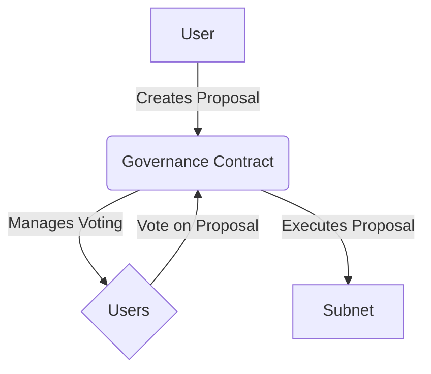

# Lesson 5: Governance

**Goal:** To learn how to implement on-chain governance for a Subnet, including voting and proposal mechanisms, and to understand the different types of governance models and their use cases.

**Prerequisites:** A basic understanding of Subnets and smart contracts. A basic understanding of Solidity is recommended.

**Estimated time:** 90 minutes

---

## Conceptual Explanation

On-chain governance is the process of managing a Subnet through the use of smart contracts. This allows for a decentralized and transparent decision-making process.

### Implementing On-Chain Governance for a Subnet

You can implement on-chain governance for a Subnet by deploying a set of smart contracts that define the rules of the governance process. These smart contracts will be responsible for managing proposals, voting, and the execution of proposals.

### Voting and Proposal Mechanisms

There are a number of different voting and proposal mechanisms that you can use, including:

*   **Token-based voting:** Token-based voting is a system where the weight of a user's vote is proportional to the number of tokens that they hold.
*   **Quadratic voting:** Quadratic voting is a system where the cost of a user's vote increases quadratically with the number of votes that they cast.
*   **Futarchy:** Futarchy is a system where prediction markets are used to make decisions.

## Annotated Diagrams (Mermaid)



## Hands-on Lab

In this lab, we will deploy a simple governance contract to a local Subnet.

1.  **Start a local testnet:**
    ```bash
    avalanche network start
    ```
2.  **Create a new Subnet:**
    ```bash
    avalanche subnet create myGovernanceSubnet --vm Subnet-EVM
    ```
3.  **Deploy the Subnet to the local testnet:**
    ```bash
    avalanche subnet deploy myGovernanceSubnet --network local
    ```
4.  **Create a new Hardhat project:**
    ```bash
    npx hardhat
    ```
5.  **Install the OpenZeppelin Contracts library:**
    ```bash
    npm install @openzeppelin/contracts
    ```
6.  **Create a new governance token contract:**
    ```solidity
    // contracts/MyToken.sol
    pragma solidity ^0.8.0;

    import "@openzeppelin/contracts/token/ERC20/ERC20.sol";
    import "@openzeppelin/contracts/token/ERC20/extensions/ERC20Votes.sol";
    import "@openzeppelin/contracts/access/Ownable.sol";

    contract MyToken is ERC20, ERC20Votes, Ownable {
        constructor() ERC20("MyToken", "MTK") ERC20Permit("MyToken") Ownable(msg.sender) {}

        function _afterTokenTransfer(address from, address to, uint256 amount) internal override(ERC20, ERC20Votes) {
            super._afterTokenTransfer(from, to, amount);
        }

        function mint(address to, uint256 amount) public onlyOwner {
            _mint(to, amount);
        }

        function _mint(address to, uint256 amount) internal override(ERC20, ERC20Votes) {
            super._mint(to, amount);
        }

        function _burn(address account, uint256 amount) internal override(ERC20, ERC20Votes) {
            super._burn(account, amount);
        }
    }
    ```
7.  **Create a new governance contract:**
    ```solidity
    // contracts/MyGovernor.sol
    pragma solidity ^0.8.0;

    import "@openzeppelin/contracts/governance/Governor.sol";
    import "@openzeppelin/contracts/governance/extensions/GovernorVotes.sol";
    import "@openzeppelin/contracts/governance/extensions/GovernorVotesQuorumFraction.sol";

    contract MyGovernor is Governor, GovernorVotes, GovernorVotesQuorumFraction {
        constructor(IVotes _token, uint256 quorumPercentage)
            Governor("MyGovernor")
            GovernorVotes(_token)
            GovernorVotesQuorumFraction(quorumPercentage)
        {}
    }
    ```
8.  **Create a deployment script:**
    ```javascript
    // scripts/deploy.js
    async function main() {
        const MyToken = await ethers.getContractFactory("MyToken");
        const myToken = await MyToken.deploy();
        console.log("MyToken deployed to:", myToken.address);

        const MyGovernor = await ethers.getContractFactory("MyGovernor");
        const myGovernor = await MyGovernor.deploy(myToken.address, 4);
        console.log("MyGovernor deployed to:", myGovernor.address);
    }

    main()
        .then(() => process.exit(0))
        .catch(error => {
            console.error(error);
            process.exit(1);
        });
    ```
9.  **Deploy the contracts to the Subnet:**
    ```bash
    npx hardhat run scripts/deploy.js --network local
    ```

## Exercises

1.  What is on-chain governance, and what are the benefits of using it?
2.  What are some different voting and proposal mechanisms, and what are their trade-offs?
3.  How can you implement on-chain governance for a Subnet, and what are some of the challenges involved?
4.  What are some of the security considerations that you need to take into account when you are designing a governance system?

## Solutions

1.  On-chain governance is the process of managing a Subnet through the use of smart contracts. The benefits of using it are that it is decentralized, transparent, and censorship-resistant.
2.  Some different voting and proposal mechanisms are token-based voting, quadratic voting, and futarchy. The trade-offs are that token-based voting is simple but it can be plutocratic, quadratic voting is more democratic but it is more complex, and futarchy is the most complex but it can be the most effective.
3.  You can implement on-chain governance for a Subnet by deploying a set of smart contracts that define the rules of the governance process. Some of the challenges involved are that it can be difficult to design a governance system that is both fair and effective, and it can be difficult to get the community to participate in the governance process.
4.  Some of the security considerations that you need to take into account when you are designing a governance system are that you need to protect against Sybil attacks, you need to protect against 51% attacks, and you need to protect against malicious proposals.

## References

*   [OpenZeppelin Governor](https://docs.openzeppelin.com/contracts/4.x/api/governance)
