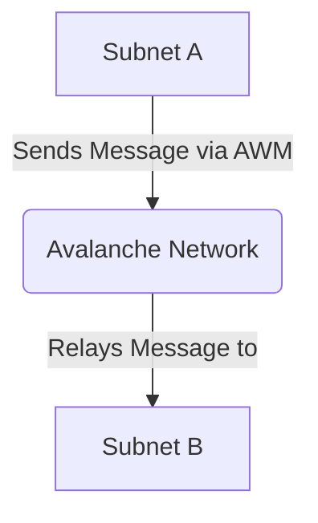

# Lesson 6: Cross-Subnet Communication

**Goal:** To learn how to send and receive messages between Subnets using Avalanche Warp Messaging (AWM), and to understand the different types of cross-subnet communication and their use cases.

**Prerequisites:** A basic understanding of Subnets and smart contracts. A basic understanding of Solidity is recommended.

**Estimated time:** 90 minutes

---

## Conceptual Explanation

Avalanche Warp Messaging (AWM) is a protocol that allows for the transfer of data between Subnets. This is useful for building dApps that need to communicate with other dApps on different Subnets.

### Introduction to Avalanche Warp Messaging (AWM)

AWM is a trustless and decentralized protocol that is built on top of the Avalanche network. It is designed to be highly scalable and efficient, and it allows for the transfer of arbitrary data between Subnets. AWM is a key part of the Avalanche interoperability story, and it is what makes it possible to build a network of interconnected Subnets.

### Sending and Receiving Messages between Subnets

To send a message from one Subnet to another, you need to call a special function on a pre-compiled contract. The message will then be relayed to the destination Subnet, where it can be processed by a smart contract.

## Annotated Diagrams (Mermaid)



## Hands-on Lab

In this lab, we will use AWM to send a message from one Subnet to another.

1.  **Start a local testnet:**
    ```bash
    avalanche network start
    ```
2.  **Create two new Subnets:**
    ```bash
    avalanche subnet create subnetA --vm Subnet-EVM
    avalanche subnet create subnetB --vm Subnet-EVM
    ```
3.  **Deploy the Subnets to the local testnet:**
    ```bash
    avalanche subnet deploy subnetA --network local
    avalanche subnet deploy subnetB --network local
    ```
    Take note of the `Blockchain ID` for both Subnets.
4.  **Create a new Hardhat project:**
    ```bash
    npx hardhat
    ```
5.  **Install the Avalanche Warp Messaging library:**
    ```bash
    npm install @avalabs/warp-sdk
    ```
6.  **Create a new contract that can send a message:**
    ```solidity
    // contracts/Sender.sol
    pragma solidity ^0.8.0;

    import "@avalabs/warp-sdk/contracts/IWarpMessenger.sol";

    contract Sender {
        IWarpMessenger constant warpMessenger = IWarpMessenger(0x0200000000000000000000000000000000000005);

        function sendMessage(bytes32 recipientSubnetID, bytes calldata message) external {
            warpMessenger.sendWarpMessage(recipientSubnetID, message);
        }
    }
    ```
7.  **Create a new contract that can receive a message:**
    ```solidity
    // contracts/Receiver.sol
    pragma solidity ^0.8.0;

    import "@avalabs/warp-sdk/contracts/IWarpReceiver.sol";

    contract Receiver is IWarpReceiver {
        event MessageReceived(bytes message);

        function receiveWarpMessage(bytes calldata message) external override {
            emit MessageReceived(message);
        }
    }
    ```
8.  **Create a deployment script:**
    ```javascript
    // scripts/deploy.js
    async function main() {
        const Sender = await ethers.getContractFactory("Sender");
        const sender = await Sender.deploy();
        console.log("Sender deployed to:", sender.address);

        const Receiver = await ethers.getContractFactory("Receiver");
        const receiver = await Receiver.deploy();
        console.log("Receiver deployed to:", receiver.address);
    }

    main()
        .then(() => process.exit(0))
        .catch(error => {
            console.error(error);
            process.exit(1);
        });
    ```
9.  **Configure Hardhat for the two Subnets:**
    ```javascript
    // hardhat.config.js
    require("@nomicfoundation/hardhat-toolbox");
    require("dotenv").config();

    module.exports = {
        solidity: "0.8.0",
        networks: {
            subnetA: {
                url: "http://127.0.0.1:9650/ext/bc/<subnetA-blockchain-id>/rpc",
                accounts: [process.env.PRIVATE_KEY]
            },
            subnetB: {
                url: "http://127.0.0.1:9650/ext/bc/<subnetB-blockchain-id>/rpc",
                accounts: [process.env.PRIVATE_KEY]
            }
        }
    };
    ```
10. **Deploy the contracts to the Subnets:**
    ```bash
    npx hardhat run scripts/deploy.js --network subnetA
    npx hardhat run scripts/deploy.js --network subnetB
    ```

## Exercises

1.  What is Avalanche Warp Messaging (AWM), and what are the benefits of using it?
2.  How do you send and receive messages between Subnets using AWM?
3.  What are some of the use cases for cross-subnet communication?
4.  What are some of the challenges of building a cross-subnet dApp?

## Solutions

1.  Avalanche Warp Messaging (AWM) is a protocol that allows for the transfer of data between Subnets. The benefits of using it are that it is trustless, decentralized, scalable, and efficient.
2.  You can send and receive messages between Subnets using AWM by calling a special function on a pre-compiled contract.
3.  Some of the use cases for cross-subnet communication are cross-chain dApps, decentralized exchanges, and oracles.
4.  Some of the challenges of building a cross-subnet dApp are that it can be difficult to manage the state of the dApp across multiple Subnets, and it can be difficult to ensure that the dApp is secure.

## References

*   [Avalanche Warp Messaging](https://docs.avax.network/build/cross-subnet-communication/avalanche-warp-messaging)
