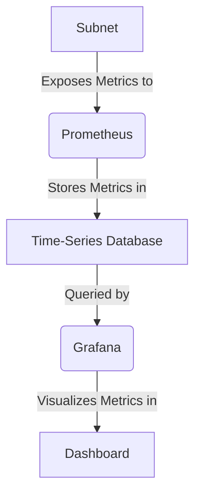

# Lesson 7: Monitoring and Observability

**Goal:** To learn how to set up monitoring for a Subnet using Prometheus and Grafana, and to understand the importance of monitoring and observability for maintaining the health and performance of your Subnet.

**Prerequisites:** A basic understanding of Subnets and validators. A basic understanding of Prometheus and Grafana is recommended.

**Estimated time:** 90 minutes

---

## Conceptual Explanation

Monitoring and observability are essential for maintaining the health and performance of your Subnet. By setting up monitoring, you can collect metrics about your Subnet, and by setting up observability, you can visualize and analyze these metrics.

### Setting up Monitoring for a Subnet

You can set up monitoring for a Subnet by using Prometheus, which is an open-source monitoring and alerting toolkit. Prometheus will scrape metrics from your Subnet and store them in a time-series database.

### Using Prometheus and Grafana

Once you have collected metrics with Prometheus, you can use Grafana to visualize and analyze them. Grafana is an open-source platform for monitoring and observability that allows you to create dashboards and alerts.

## Annotated Diagrams (Mermaid)



## Hands-on Lab

In this lab, we will set up monitoring for a Subnet using Prometheus and Grafana.

1.  **Start a local testnet:**
    ```bash
    avalanche network start
    ```
2.  **Create a new Subnet:**
    ```bash
    avalanche subnet create myMonitoredSubnet --vm Subnet-EVM
    ```
3.  **Deploy the Subnet to the local testnet:**
    ```bash
    avalanche subnet deploy myMonitoredSubnet --network local
    ```
4.  **Create a `docker-compose.yml` file:**
    ```yaml
    version: '3'
    services:
      prometheus:
        image: prom/prometheus
        ports:
          - 9090:9090
        volumes:
          - ./prometheus.yml:/etc/prometheus/prometheus.yml
      grafana:
        image: grafana/grafana
        ports:
          - 3000:3000
    ```
5.  **Create a `prometheus.yml` file:**
    ```yaml
    global:
      scrape_interval: 15s
    scrape_configs:
      - job_name: 'avalanche'
        static_configs:
          - targets: ['host.docker.internal:9650']
    ```
6.  **Start Prometheus and Grafana:**
    ```bash
    docker-compose up -d
    ```
7.  **Open Grafana in your browser at `http://localhost:3000` and add Prometheus as a data source.**
8.  **Import a pre-built dashboard for Avalanche.** You can find a list of community-created dashboards [here](https://grafana.com/grafana/dashboards/?search=avalanche).

## Exercises

1.  What is monitoring, and what is observability?
2.  What are some of the benefits of setting up monitoring and observability for your Subnet?
3.  What are Prometheus and Grafana, and how can they be used to set up monitoring and observability?
4.  What are some of the key metrics that you should monitor for your Subnet?

## Solutions

1.  Monitoring is the process of collecting metrics about your Subnet. Observability is the process of visualizing and analyzing the metrics that you have collected.
2.  Some of the benefits of setting up monitoring and observability for your Subnet are that you can identify and resolve performance bottlenecks, you can detect and respond to security threats, and you can gain a better understanding of how your Subnet is being used.
3.  Prometheus is an open-source monitoring and alerting toolkit. Grafana is an open-source platform for monitoring and observability. They can be used to set up monitoring and observability by scraping metrics from your Subnet and visualizing them in a dashboard.
4.  Some of the key metrics that you should monitor for your Subnet are the number of transactions per second, the average block time, the number of validators, and the staking rate.

## References

*   [Monitoring an Avalanche Node](https://docs.avax.network/nodes/maintain/setting-up-node-monitoring)
