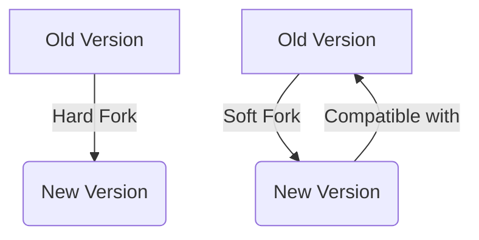

# Lesson 8: Upgrade Patterns

**Goal:** To learn about different strategies for upgrading a Subnet, including hard forks and soft forks, and to understand the trade-offs between different upgrade patterns.

**Prerequisites:** A basic understanding of Subnets and governance.

**Estimated time:** 60 minutes

---

## Conceptual Explanation

As your Subnet evolves, you will need to upgrade it to add new features and fix bugs. There are a number of different strategies that you can use to upgrade your Subnet, including hard forks and soft forks.

### Strategies for Upgrading a Subnet

*   **Hard fork:** A hard fork is a backward-incompatible upgrade that requires all nodes to upgrade to the new version of the software. Hard forks are typically used for major upgrades, such as changes to the consensus protocol or the state model.
*   **Soft fork:** A soft fork is a backward-compatible upgrade that does not require all nodes to upgrade to the new version of the software. Soft forks are typically used for minor upgrades, such as changes to the transaction format or the fee mechanism.

### Hard Forks and Soft Forks

The decision of whether to use a hard fork or a soft fork will depend on the nature of the upgrade. If the upgrade is backward-incompatible, then you will need to use a hard fork. If the upgrade is backward-compatible, then you can use a soft fork.

Hard forks are more disruptive than soft forks, but they are also more powerful. Soft forks are less disruptive than hard forks, but they are also less powerful.

## Annotated Diagrams (Mermaid)



## Hands-on Lab

In this lab, we will perform a soft fork and a hard fork on a local Subnet.

1.  **Start a local testnet:**
    ```bash
    avalanche network start
    ```
2.  **Create a new Subnet:**
    ```bash
    avalanche subnet create myUpgradableSubnet --vm Subnet-EVM
    ```
3.  **Deploy the Subnet to the local testnet:**
    ```bash
    avalanche subnet deploy myUpgradableSubnet --network local
    ```
4.  **Perform a soft fork by upgrading the Subnet-EVM:**
    ```bash
    # This can be done by updating the Subnet-EVM binary and restarting the nodes.
    # For this lab, we will simulate this by changing the gas limit in the genesis file.
    # Open subnets/myUpgradableSubnet.json and change the gasLimit to 8000001
    avalanche subnet deploy myUpgradableSubnet --network local --upgrade
    ```
5.  **Perform a hard fork by changing the chain ID:**
    ```json
    // subnets/myUpgradableSubnet.json
    {
        ...
        "chainId": 1338,
        ...
    }
    ```
6.  **Redeploy the Subnet:**
    ```bash
    avalanche subnet deploy myUpgradableSubnet --network local
    ```

## Exercises

1.  What is a hard fork, and what is a soft fork?
2.  What are the trade-offs between hard forks and soft forks?
3.  When should you use a hard fork, and when should you use a soft fork?
4.  What are some of the challenges of performing a hard fork?

## Solutions

1.  A hard fork is a backward-incompatible upgrade that requires all nodes to upgrade to the new version of the software. A soft fork is a backward-compatible upgrade that does not require all nodes to upgrade to the new version of the software.
2.  The trade-offs between hard forks and soft forks are that hard forks are more disruptive but they are also more powerful, while soft forks are less disruptive but they are also less powerful.
3.  You should use a hard fork when you are making a backward-incompatible upgrade. You should use a soft fork when you are making a backward-compatible upgrade.
4.  Some of the challenges of performing a hard fork are that it can be difficult to coordinate the upgrade, and it can be difficult to ensure that all nodes upgrade to the new version of the software.

## References

*   [Hard Forks vs. Soft Forks](https://www.coinbase.com/learn/crypto-basics/what-is-a-hard-fork)
