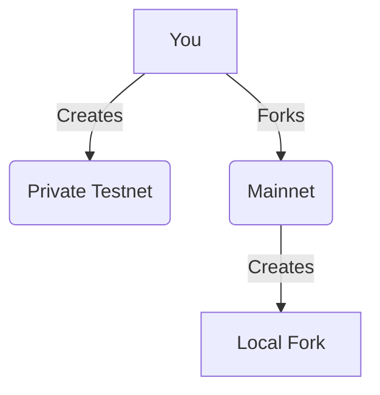

# Lesson 9: Testnets and Forking

**Goal:** To learn how to set up a private testnet, fork the mainnet for testing, and understand the benefits of using testnets and forking for Subnet development.

**Prerequisites:** A basic understanding of Subnets and the Avalanche-CLI.

**Estimated time:** 60 minutes

---

## Conceptual Explanation

Testnets are essential for testing your Subnet before you deploy it to the mainnet. You can set up a private testnet to test your Subnet in a controlled environment. You can also fork the mainnet to test your Subnet with real-world data.

### Setting up a Private Testnet

You can set up a private testnet by using the Avalanche-CLI. The `avalanche network start` command allows you to create a local testnet with a single command. Private testnets are useful for testing your Subnet in a controlled environment. You can create your own genesis file, you can control the number of nodes, and you can control the network conditions.

### Forking the Mainnet for Testing

You can fork the mainnet by using a tool like Hardhat. This will create a local copy of the mainnet that you can use for testing. Forking the mainnet is useful for testing your Subnet with real-world data. You can test your Subnet with the same state as the mainnet, and you can test your Subnet with the same transaction volume as the mainnet.

## Annotated Diagrams (Mermaid)



## Hands-on Lab

In this lab, we will set up a private testnet and fork the mainnet for testing.

1.  **Start a private testnet:**
    ```bash
    avalanche network start
    ```
2.  **Create a new Subnet:**
    ```bash
    avalanche subnet create myForkedSubnet --vm Subnet-EVM
    ```
3.  **Deploy the Subnet to the private testnet:**
    ```bash
    avalanche subnet deploy myForkedSubnet --network local
    ```
4.  **Fork the mainnet:**
    ```bash
    npx hardhat node --fork https://api.avax.network/ext/bc/C/rpc
    ```
5.  **Configure Hardhat to deploy to the forked mainnet:**
    ```javascript
    // hardhat.config.js
    require("@nomicfoundation/hardhat-toolbox");
    require("dotenv").config();

    module.exports = {
        solidity: "0.8.0",
        networks: {
            local: {
                url: "http://127.0.0.1:9650/ext/bc/C/rpc",
                accounts: [process.env.PRIVATE_KEY]
            },
            fork: {
                url: "http://127.0.0.1:8545",
                accounts: [process.env.PRIVATE_KEY]
            }
        }
    };
    ```
6.  **Create a new Hardhat project and deployment script as in the `03_deploying_smart_contracts_to_the_c_chain.md` lesson.**
7.  **Deploy a contract to the forked mainnet:**
    ```bash
    npx hardhat run scripts/deploy.js --network fork
    ```

## Exercises

1.  What is a testnet, and what are the benefits of using a private testnet?
2.  What is forking, and what are the benefits of forking the mainnet for testing?
3.  How do you set up a private testnet using the Avalanche-CLI?
4.  How do you fork the mainnet using Hardhat?

## Solutions

1.  A testnet is a separate blockchain that is used for testing. The benefits of using a private testnet are that you can test your Subnet in a controlled environment.
2.  Forking is the process of creating a local copy of a blockchain. The benefits of forking the mainnet for testing are that you can test your Subnet with real-world data.
3.  You can set up a private testnet using the `avalanche network start` command.
4.  You can fork the mainnet using the `npx hardhat node --fork` command.

## References

*   [Avalanche Testnet](https://docs.avax.network/build/dapp/networks/fuji-avalanche-testnet)
*   [Hardhat Network Forking](https://hardhat.org/hardhat-network/docs/guides/forking)
