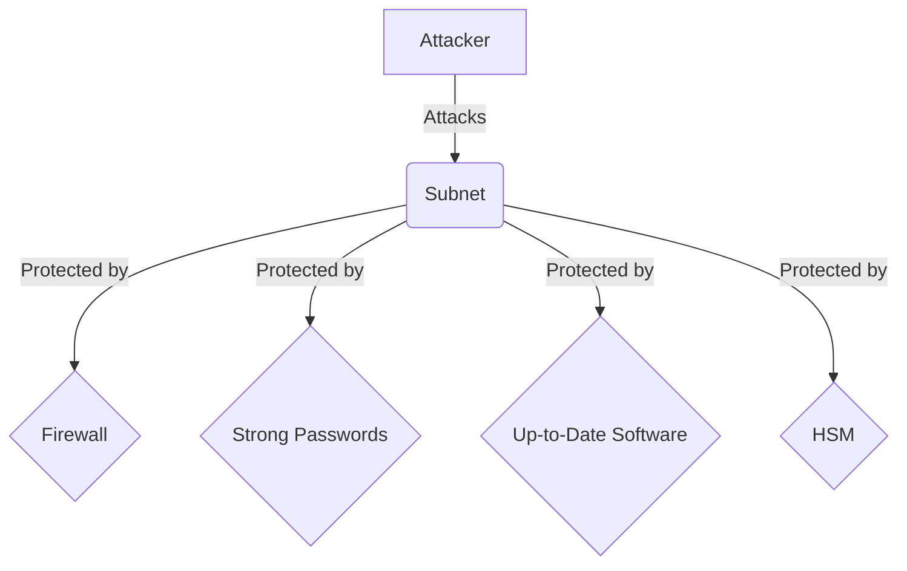

# Lesson 1: Production Hardening

**Goal:** To learn about security best practices for Subnets, how to protect against common attacks, and how to harden your Subnet for production.

**Prerequisites:** A basic understanding of Subnets and security.

**Estimated time:** 75 minutes

---

## Conceptual Explanation

When you deploy a Subnet to production, it is important to take steps to harden it against attack. There are a number of security best practices that you should follow to protect your Subnet from common attacks.

### Security Best Practices for Subnets

*   **Use a secure operating system:** You should use a secure operating system, such as Ubuntu 22.04 LTS, for your Subnet nodes.
*   **Use a firewall:** You should use a firewall to restrict access to your Subnet nodes. Only allow traffic from trusted sources.
*   **Use a strong password:** You should use a strong password for your Subnet nodes. You should also use a different password for each node.
*   **Keep your software up to date:** You should keep your software up to date to protect against known vulnerabilities. This includes the operating system, the AvalancheGo software, and any other software that you are running on your nodes.
*   **Use a hardware security module (HSM):** You should use an HSM to store your private keys. An HSM is a physical device that is designed to protect your private keys from unauthorized access.

### Protecting against Common Attacks

*   **Denial-of-service (DoS) attacks:** You can protect against DoS attacks by using a firewall and by rate-limiting requests.
*   **Sybil attacks:** You can protect against Sybil attacks by requiring validators to stake a certain amount of AVAX.
*   **51% attacks:** You can protect against 51% attacks by ensuring that your Subnet is sufficiently decentralized.

## Annotated Diagrams (Mermaid)



## Hands-on Lab

In this lab, we will harden a Subnet for production.

1.  **Start a local testnet:**
    ```bash
    avalanche network start
    ```
2.  **Create a new Subnet:**
    ```bash
    avalanche subnet create myHardenedSubnet --vm Subnet-EVM
    ```
3.  **Deploy the Subnet to the local testnet:**
    ```bash
    avalanche subnet deploy myHardenedSubnet --network local
    ```
4.  **Configure a firewall for the Subnet:**
    ```bash
    # We will use ufw for this lab.
    sudo ufw allow 9650
    sudo ufw enable
    ```
5.  **Generate a strong password for the Subnet:**
    ```bash
    openssl rand -base64 32
    ```
6.  **Update the software on the Subnet nodes:**
    ```bash
    # This assumes you are using a Debian-based Linux distribution.
    sudo apt-get update
    sudo apt-get upgrade -y
    ```
7.  **Configure an HSM for the Subnet:**
    ```bash
    # This is a complex process that depends on your specific HSM.
    # We recommend following the documentation for your HSM.
    # For a software-based HSM, you could use a tool like HashiCorp Vault.
    ```

## Exercises

1.  What are some security best practices for Subnets, and why are they important?
2.  What are some common attacks against Subnets, and how can you protect against them?
3.  What is an HSM, and why is it important to use one to store your private keys?
4.  What are some of the challenges of hardening a Subnet for production?

## Solutions

1.  Some security best practices for Subnets are to use a secure operating system, a firewall, a strong password, and an HSM. They are important because they can help to protect your Subnet from attack.
2.  Some common attacks against Subnets are DoS attacks, Sybil attacks, and 51% attacks. You can protect against them by using a firewall, by requiring validators to stake a certain amount of AVAX, and by ensuring that your Subnet is sufficiently decentralized.
3.  An HSM is a physical device that is designed to protect your private keys from unauthorized access. It is important to use one to store your private keys because it can help to protect your private keys from being stolen.
4.  Some of the challenges of hardening a Subnet for production are that it can be difficult to configure a firewall, it can be difficult to generate a strong password, and it can be difficult to update the software on the Subnet nodes.

## References

*   [Avalanche Security Best Practices](https://docs.avax.network/nodes/maintain/security-best-practices)
