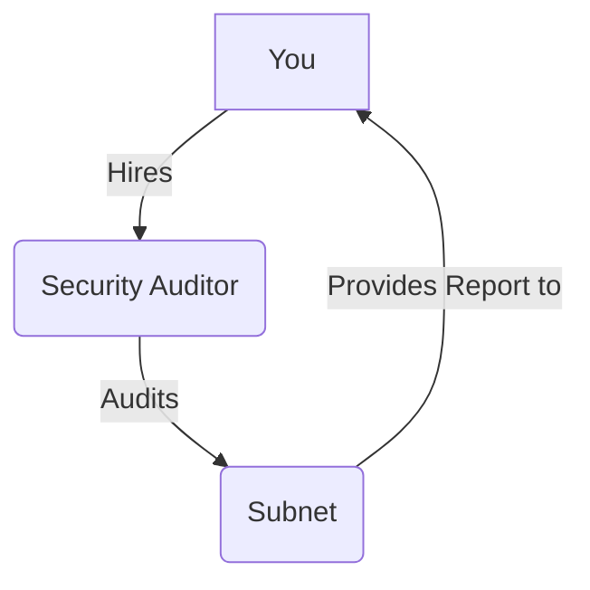

# Lesson 2: Security and Auditing Checklist

**Goal:** To learn about the importance of security audits, to review a checklist for auditing a Subnet, and to understand how to work with security auditors.

**Prerequisites:** A basic understanding of Subnets and security.

**Estimated time:** 60 minutes

---

## Conceptual Explanation

A security audit is a process of reviewing the security of your Subnet. It is important to have your Subnet audited by a third-party security firm before you deploy it to production. A security audit can help you to identify and fix security vulnerabilities, and it can give you peace of mind knowing that your Subnet is secure.

### A Checklist for Auditing a Subnet

*   **Code review:** The auditor will review the code of your Subnet for security vulnerabilities. This includes the smart contracts, the VM, and any other code that is running on your Subnet.
*   **Architectural review:** The auditor will review the architecture of your Subnet for security vulnerabilities. This includes the network topology, the consensus protocol, and the governance system.
*   **Penetration testing:** The auditor will attempt to exploit any security vulnerabilities that they have found. This can help you to identify and fix security vulnerabilities that you may have missed.

### Working with Security Auditors

When you are working with a security auditor, it is important to be transparent and to provide them with all of the information that they need. You should also be prepared to fix any security vulnerabilities that they find. A good security auditor will work with you to fix any security vulnerabilities that they find, and they will provide you with a detailed report of their findings.

## Annotated Diagrams (Mermaid)



## Hands-on Lab

In this lab, we will use a static analysis tool to audit a Subnet.

1.  **Start a local testnet:**
    ```bash
    avalanche network start
    ```
2.  **Create a new Subnet:**
    ```bash
    avalanche subnet create myAuditedSubnet --vm Subnet-EVM
    ```
3.  **Deploy the Subnet to the local testnet:**
    ```bash
    avalanche subnet deploy myAuditedSubnet --network local
    ```
4.  **Create a new Hardhat project:**
    ```bash
    npx hardhat
    ```
5.  **Install the Slither static analysis tool:**
    ```bash
    pip install slither-analyzer
    ```
6.  **Run Slither on your Hardhat project:**
    ```bash
    slither .
    ```

## Exercises

1.  What is a security audit, and why is it so important for Subnets?
2.  What are the three parts of a security audit, and what does each part entail?
3.  How do you work with security auditors, and what are some of the things you should look for in a good security auditor?
4.  What are some of the tools that you can use to audit your Subnet?

## Solutions

1.  A security audit is a process of reviewing the security of your Subnet. It is so important for Subnets because it can help you to identify and fix security vulnerabilities.
2.  The three parts of a security audit are code review, architectural review, and penetration testing. Code review entails reviewing the code of your Subnet for security vulnerabilities. Architectural review entails reviewing the architecture of your Subnet for security vulnerabilities. Penetration testing entails attempting to exploit any security vulnerabilities that they have found.
3.  You can work with security auditors by being transparent and by providing them with all of the information that they need. Some of the things you should look for in a good security auditor are that they have a good reputation, they have experience auditing similar Subnets, and they are willing to work with you to fix any security vulnerabilities that they find.
4.  Some of the tools that you can use to audit your Subnet are static analysis tools, dynamic analysis tools, and formal verification tools.

## References

*   [Avalanche Audits](https://www.avalabs.org/audits)
