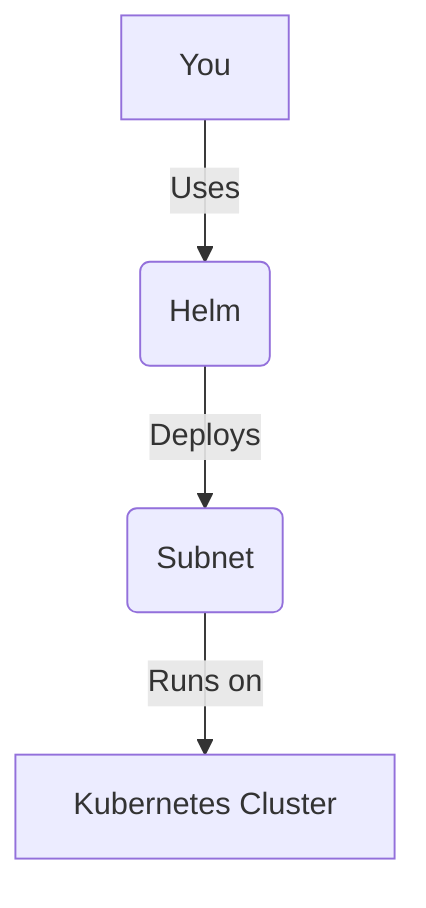

# Lesson 3: Infrastructure (Kubernetes/Helm)

**Goal:** To learn how to deploy a Subnet to a Kubernetes cluster, use Helm charts for automation, and understand the benefits of using Kubernetes and Helm for Subnet infrastructure.

**Prerequisites:** A basic understanding of Subnets, Kubernetes, and Helm.

**Estimated time:** 90 minutes

---

## Conceptual Explanation

Kubernetes is a container orchestration platform that can be used to manage and scale your Subnet. Helm is a package manager for Kubernetes that can be used to deploy and manage your Subnet. By using Kubernetes and Helm, you can automate the deployment and management of your Subnet, and you can make your Subnet more resilient and scalable.

### Deploying a Subnet to a Kubernetes Cluster

You can deploy a Subnet to a Kubernetes cluster by using a Helm chart. A Helm chart is a package of pre-configured Kubernetes resources that can be used to deploy your Subnet. The Avalanche community has created a Helm chart for deploying Avalanche nodes, which you can use to deploy your Subnet.

### Using Helm Charts for Automation

Helm charts can be used to automate the deployment and management of your Subnet. This can help to save you time and to reduce the risk of human error. For example, you can use a Helm chart to automatically deploy a new version of your Subnet, or you can use a Helm chart to automatically scale your Subnet up or down.

## Annotated Diagrams (Mermaid)



## Hands-on Lab

In this lab, we will use Helm to deploy a Subnet to a local Kubernetes cluster.

1.  **Start a local Kubernetes cluster:**
    ```bash
    # We will use minikube for this lab.
    minikube start
    ```
2.  **Add the Avalanche Helm chart repository:**
    ```bash
    helm repo add avalanche https://ava-labs.github.io/avalanche-helm-charts
    ```
3.  **Update the Helm chart repository:**
    ```bash
    helm repo update
    ```
4.  **Install the Avalanche Helm chart:**
    ```bash
    helm install my-subnet avalanche/avalanche-node
    ```
5.  **Scale the number of nodes in the Subnet:**
    ```bash
    helm upgrade my-subnet avalanche/avalanche-node --set replicaCount=3
    ```
6.  **Uninstall the Avalanche Helm chart:**
    ```bash
    helm uninstall my-subnet
    ```

## Exercises

1.  What is Kubernetes, and what is Helm?
2.  What are the benefits of using Kubernetes and Helm for Subnet infrastructure?
3.  How do you deploy a Subnet to a Kubernetes cluster using a Helm chart?
4.  How do you use Helm charts to automate the deployment and management of your Subnet?

## Solutions

1.  Kubernetes is a container orchestration platform that can be used to manage and scale your Subnet. Helm is a package manager for Kubernetes that can be used to deploy and manage your Subnet.
2.  The benefits of using Kubernetes and Helm for Subnet infrastructure are that you can automate the deployment and management of your Subnet, and you can make your Subnet more resilient and scalable.
3.  You can deploy a Subnet to a Kubernetes cluster using a Helm chart by adding the Avalanche Helm chart repository, updating the Helm chart repository, and then installing the Avalanche Helm chart.
4.  You can use Helm charts to automate the deployment and management of your Subnet by creating a Helm chart for your Subnet and then using a CI/CD pipeline to automatically deploy the Helm chart to your Kubernetes cluster.

## References

*   [Avalanche Helm Charts](https://github.com/ava-labs/avalanche-helm-charts)
