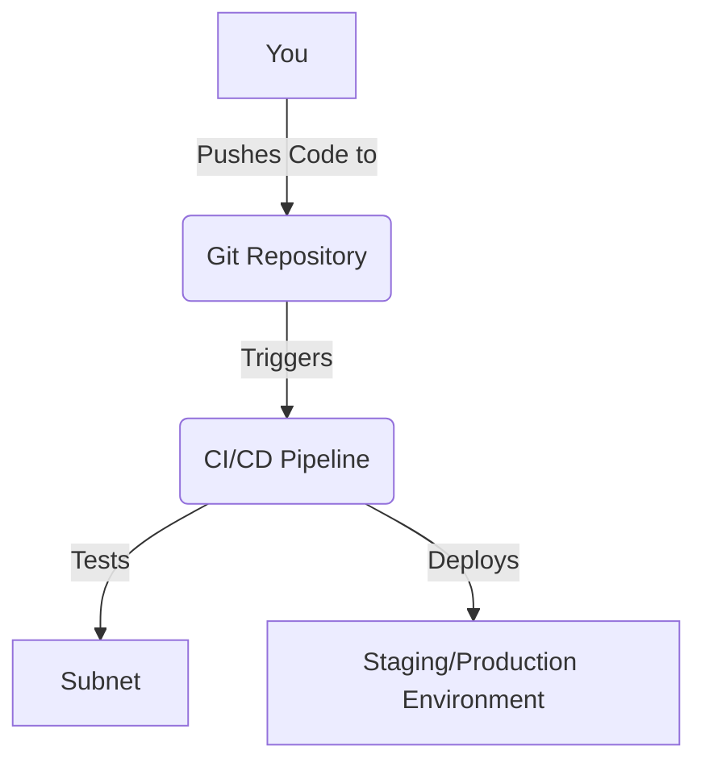

# Lesson 4: CI/CD for Subnets

**Goal:** To learn how to set up a CI/CD pipeline for a Subnet, automate testing and deployment, and understand the benefits of using CI/CD for Subnet development.

**Prerequisites:** A basic understanding of Subnets, CI/CD, and Git.

**Estimated time:** 90 minutes

---

## Conceptual Explanation

CI/CD is the process of automating the testing and deployment of your Subnet. By setting up a CI/CD pipeline, you can save time, reduce the risk of human error, and improve the quality of your Subnet.

### Setting up a CI/CD Pipeline for a Subnet

You can set up a CI/CD pipeline for a Subnet by using a tool like GitHub Actions. GitHub Actions is a CI/CD platform that is integrated with GitHub. You can use GitHub Actions to automatically build, test, and deploy your Subnet every time you push a change to your Git repository.

### Automating Testing and Deployment

You can automate the testing and deployment of your Subnet by using a CI/CD pipeline. This will allow you to automatically test your Subnet every time you push a change to your Git repository. If the tests pass, the CI/CD pipeline will automatically deploy your Subnet to your staging or production environment.

## Annotated Diagrams (Mermaid)



## Hands-on Lab

In this lab, we will set up a CI/CD pipeline for a Subnet using GitHub Actions.

1.  **Create a new repository on GitHub.**
2.  **Clone the repository to your local machine:**
    ```bash
    git clone <your-repository-url>
    ```
3.  **Create a new Subnet:**
    ```bash
    avalanche subnet create myCISubnet --vm Subnet-EVM
    ```
4.  **Create a new GitHub Actions workflow file:**
    ```yaml
    # .github/workflows/main.yml
    name: CI/CD
    on:
        push:
            branches:
                - main
    jobs:
        build:
            runs-on: ubuntu-latest
            steps:
                - uses: actions/checkout@v2
                - name: Set up Go
                  uses: actions/setup-go@v2
                  with:
                    go-version: 1.18
                - name: Build the Subnet
                  run: |
                    cd myCISubnet
                    go build -o myCISubnet-vm
                - name: Run tests
                  run: |
                    cd myCISubnet
                    go test ./...
    ```
5.  **Commit and push the changes to your repository:**
    ```bash
    git add .
    git commit -m "Add CI/CD pipeline"
    git push
    ```

## Exercises

1.  What is CI/CD, and what are the benefits of using it for Subnet development?
2.  How do you set up a CI/CD pipeline for a Subnet using GitHub Actions?
3.  How do you automate the testing and deployment of your Subnet using a CI/CD pipeline?
4.  What are some of the challenges of setting up a CI/CD pipeline for a Subnet?

## Solutions

1.  CI/CD is the process of automating the testing and deployment of your Subnet. The benefits of using it for Subnet development are that you can save time, reduce the risk of human error, and improve the quality of your Subnet.
2.  You can set up a CI/CD pipeline for a Subnet using GitHub Actions by creating a new GitHub Actions workflow file in your Git repository.
3.  You can automate the testing and deployment of your Subnet using a CI/CD pipeline by adding steps to your GitHub Actions workflow file to build, test, and deploy your Subnet.
4.  Some of the challenges of setting up a CI/CD pipeline for a Subnet are that it can be difficult to configure the pipeline, it can be difficult to write tests for your Subnet, and it can be difficult to deploy your Subnet to a staging or production environment.

## References

*   [GitHub Actions](https://docs.github.com/en/actions)
