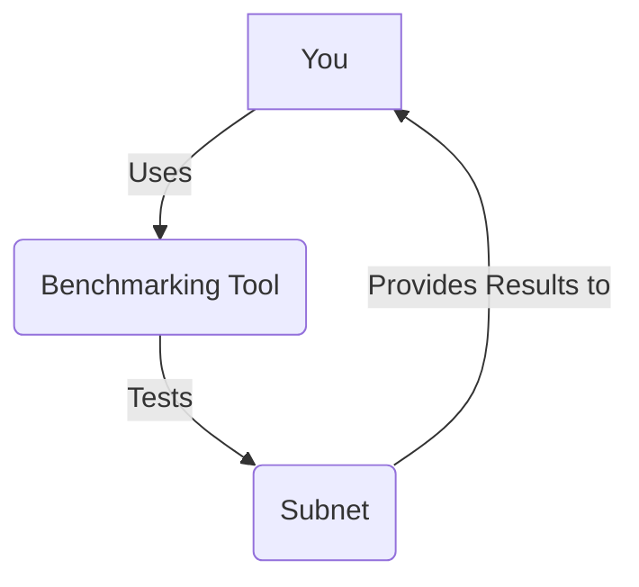

# Lesson 5: Performance Benchmarking

**Goal:** To learn about tools and techniques for benchmarking a Subnet, how to identify and resolve performance bottlenecks, and how to use performance benchmarking to improve the performance of your Subnet.

**Prerequisites:** A basic understanding of Subnets and performance testing.

**Estimated time:** 90 minutes

---

## Conceptual Explanation

Performance benchmarking is the process of testing the performance of your Subnet. By benchmarking your Subnet, you can identify and resolve performance bottlenecks, and you can improve the performance of your Subnet.

### Tools and Techniques for Benchmarking a Subnet

There are a number of tools and techniques that you can use to benchmark your Subnet, including:

*   **Load testing:** Load testing is the process of simulating a large number of users to see how your Subnet performs under load.
*   **Stress testing:** Stress testing is the process of testing the limits of your Subnet to see how it performs under extreme conditions.
*   **Soak testing:** Soak testing is the process of testing your Subnet over a long period of time to see how it performs over time.

### Identifying and Resolving Performance Bottlenecks

Once you have benchmarked your Subnet, you can use the results to identify and resolve performance bottlenecks. Some common performance bottlenecks are:

*   **CPU:** The CPU can be a bottleneck if your Subnet is not able to process transactions fast enough.
*   **Memory:** The memory can be a bottleneck if your Subnet is not able to store enough data in memory.
*   **Disk I/O:** The disk I/O can be a bottleneck if your Subnet is not able to read and write data to disk fast enough.
*   **Network:** The network can be a bottleneck if your Subnet is not able to send and receive data fast enough.

## Annotated Diagrams (Mermaid)



## Hands-on Lab

In this lab, we will use a load testing tool to benchmark a Subnet.

1.  **Start a local testnet:**
    ```bash
    avalanche network start
    ```
2.  **Create a new Subnet:**
    ```bash
    avalanche subnet create myBenchmarkedSubnet --vm Subnet-EVM
    ```
3.  **Deploy the Subnet to the local testnet:**
    ```bash
    avalanche subnet deploy myBenchmarkedSubnet --network local
    ```
4.  **Install a load testing tool:**
    ```bash
    npm install -g artillery
    ```
5.  **Create a load testing script:**
    ```yaml
    # artillery.yml
    config:
      target: "http://localhost:9650"
      phases:
        - duration: 60
          arrivalRate: 10
    scenarios:
      - flow:
        - post:
            url: "/ext/bc/C/rpc"
            json:
              jsonrpc: "2.0"
              id: 1
              method: "eth_blockNumber"
              params: []
    ```
6.  **Run the load testing script:**
    ```bash
    artillery run artillery.yml
    ```

## Exercises

1.  What is performance benchmarking, and why is it so important for Subnets?
2.  What are some tools and techniques that you can use to benchmark your Subnet?
3.  What are some common performance bottlenecks, and how can you identify and resolve them?
4.  What are some of the challenges of performance benchmarking a Subnet?

## Solutions

1.  Performance benchmarking is the process of testing the performance of your Subnet. It is so important for Subnets because it can help you to identify and resolve performance bottlenecks, and it can help you to improve the performance of your Subnet.
2.  Some tools and techniques that you can use to benchmark your Subnet are load testing, stress testing, and soak testing.
3.  Some common performance bottlenecks are CPU, memory, disk I/O, and network. You can identify and resolve them by using a performance benchmarking tool.
4.  Some of the challenges of performance benchmarking a Subnet are that it can be difficult to simulate a large number of users, it can be difficult to measure the performance of the Subnet, and it can be difficult to identify and resolve performance bottlenecks.

## References

*   [Avalanche Performance](https://www.avalabs.org/blog/avalanche-hits-testnet-milestone-achieves-record-breaking-transaction-results)
