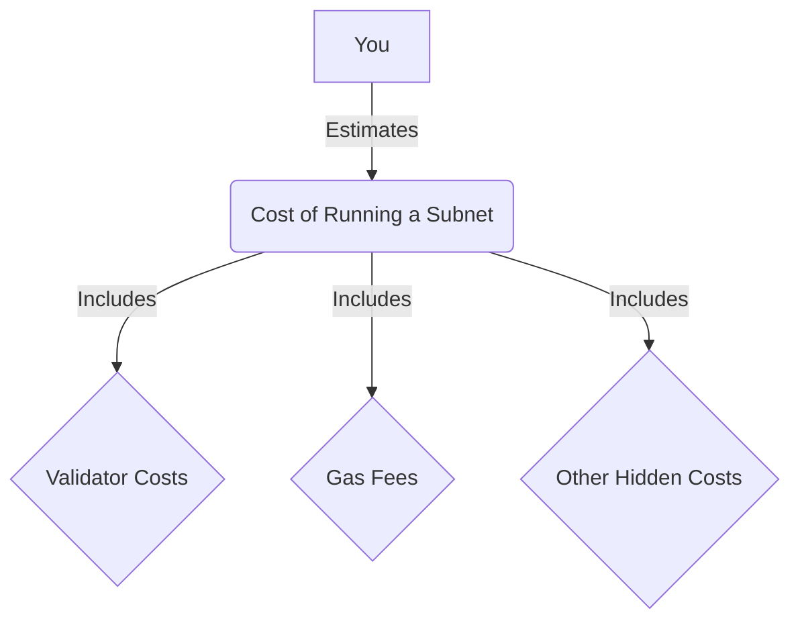

# Lesson 6: Cost Estimation

**Goal:** To learn how to estimate the cost of running a Subnet, including validator costs, gas fees, and other hidden costs.

**Prerequisites:** A basic understanding of Subnets and validators.

**Estimated time:** 60 minutes

---

## Conceptual Explanation

When you are planning to launch a Subnet, it is important to estimate the cost of running it. The cost of running a Subnet will depend on a number of factors, including the number of validators, the hardware requirements, the gas fees, and other hidden costs.

### Estimating the Cost of Running a Subnet

You can estimate the cost of running a Subnet by using the following formula:

```
Cost = (Number of validators * Cost per validator) + (Number of transactions * Gas fee per transaction) + Other hidden costs
```

### Validator Costs and Gas Fees

*   **Validator costs:** The cost of running a validator will depend on the hardware requirements, the cost of electricity, and the cost of bandwidth.
*   **Gas fees:** The gas fees will depend on the complexity of the transactions that are being processed on your Subnet.

### Other Hidden Costs

*   **Development costs:** The cost of developing and maintaining your Subnet.
*   **Marketing costs:** The cost of marketing your Subnet to attract users and validators.
*   **Legal costs:** The cost of complying with any legal and regulatory requirements.
*   **Security costs:** The cost of auditing your Subnet and protecting it from attack.

## Annotated Diagrams (Mermaid)



## Hands-on Lab

In this lab, we will estimate the cost of running a Subnet.

1.  **Estimate the number of validators:**
    ```
    # Let's assume that we will have 10 validators.
    ```
2.  **Estimate the cost per validator:**
    ```
    # Let's assume that the cost per validator is $100 per month.
    ```
3.  **Estimate the number of transactions:**
    ```
    # Let's assume that we will have 1,000,000 transactions per month.
    ```
4.  **Estimate the gas fee per transaction:**
    ```
    # Let's assume that the gas fee per transaction is $0.01.
    ```
5.  **Estimate the other hidden costs:**
    ```
    # Let's assume that the other hidden costs are $1,000 per month.
    ```
6.  **Calculate the total cost:**
    ```
    Cost = (10 * 100) + (1,000,000 * 0.01) + 1,000 = $12,000 per month
    ```

## Exercises

1.  What are the different costs that you need to consider when you are estimating the cost of running a Subnet?
2.  How do you estimate the number of validators, the cost per validator, the number of transactions, and the gas fee per transaction?
3.  What are some of the other hidden costs that you need to consider?
4.  What are some of the ways that you can reduce the cost of running a Subnet?

## Solutions

1.  The different costs that you need to consider when you are estimating the cost of running a Subnet are validator costs, gas fees, and other hidden costs.
2.  You can estimate the number of validators, the cost per validator, the number of transactions, and the gas fee per transaction by doing research and by making assumptions.
3.  Some of the other hidden costs that you need to consider are development costs, marketing costs, legal costs, and security costs.
4.  Some of the ways that you can reduce the cost of running a Subnet are by using a smaller number of validators, by using a less expensive hardware, and by using a less expensive cloud provider.

## References

*   [Avalanche Validator Costs](https://docs.avax.network/nodes/validate/staking#validator-costs)
