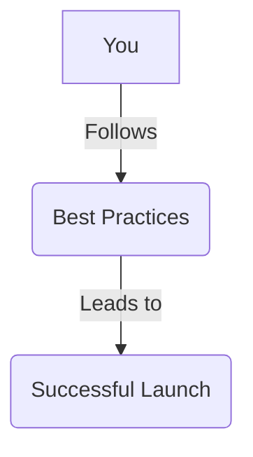

# Lesson 7: Best Practices for Launching a Subnet

**Goal:** To learn about the best practices for launching a Subnet, including a step-by-step guide to a successful launch, tips for marketing and community building, and how to avoid common pitfalls.

**Prerequisites:** A basic understanding of Subnets.

**Estimated time:** 60 minutes

---

## Conceptual Explanation

When you are ready to launch your Subnet, it is important to follow a set of best practices to ensure a successful launch. These best practices include a step-by-step guide to a successful launch, tips for marketing and community building, and how to avoid common pitfalls.

### A Step-by-Step Guide to a Successful Launch

1.  **Test your Subnet on a testnet:** Before you launch your Subnet to the mainnet, you should test it on a testnet to ensure that it is working correctly. You should also test your Subnet with a variety of different scenarios, such as a high volume of transactions and a large number of validators.
2.  **Audit your Subnet:** You should have your Subnet audited by a third-party security firm to identify and fix any security vulnerabilities. A security audit can give you peace of mind knowing that your Subnet is secure.
3.  **Launch your Subnet to the mainnet:** Once you have tested and audited your Subnet, you can launch it to the mainnet. You should launch your Subnet in a phased approach, starting with a small number of validators and then gradually increasing the number of validators over time.
4.  **Monitor your Subnet:** After you have launched your Subnet, you should monitor it to ensure that it is running smoothly. You should also be prepared to respond to any issues that may arise.

### Marketing and Community Building

*   **Marketing:** You should market your Subnet to attract users and validators. You can do this by creating a website, writing blog posts, and engaging with the community on social media.
*   **Community building:** You should build a community around your Subnet to encourage adoption and engagement. You can do this by creating a Discord server, hosting AMAs, and running a hackathon.

### How to Avoid Common Pitfalls

*   **Lack of testing:** One of the most common pitfalls is not testing your Subnet enough before you launch it to the mainnet.
*   **Lack of security:** Another common pitfall is not having your Subnet audited by a third-party security firm.
*   **Lack of marketing:** Another common pitfall is not marketing your Subnet enough to attract users and validators.
*   **Lack of community:** Another common pitfall is not building a community around your Subnet.

## Annotated Diagrams (Mermaid)

## Hands-on Lab

There is no hands-on lab for this lesson.

## Exercises

1.  What are the four steps to a successful launch, and why is each step so important?
2.  What are some tips for marketing your Subnet, and what are some tips for building a community around your Subnet?
3.  What are some of the common pitfalls that you should avoid when you are launching a Subnet?
4.  What are some of the things that you can do to ensure that your Subnet is successful in the long run?

## Solutions

1.  The four steps to a successful launch are to test your Subnet on a testnet, audit your Subnet, launch your Subnet to the mainnet, and monitor your Subnet. Each step is so important because it can help you to avoid common pitfalls and to ensure that your Subnet is successful.
2.  Some tips for marketing your Subnet are to create a website, write blog posts, and engage with the community on social media. Some tips for building a community around your Subnet are to create a Discord server, host AMAs, and run a hackathon.
3.  Some of the common pitfalls that you should avoid when you are launching a Subnet are a lack of testing, a lack of security, a lack of marketing, and a lack of community.
4.  Some of the things that you can do to ensure that your Subnet is successful in the long run are to continue to develop your Subnet, to continue to market your Subnet, and to continue to build a community around your Subnet.

## References

*   [Avalanche Community](https://www.avax.network/community)
